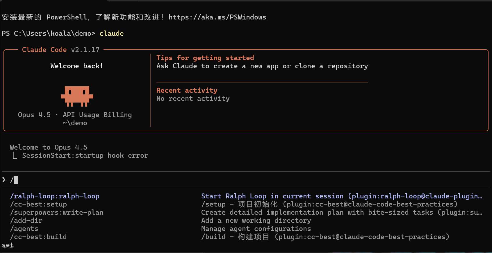
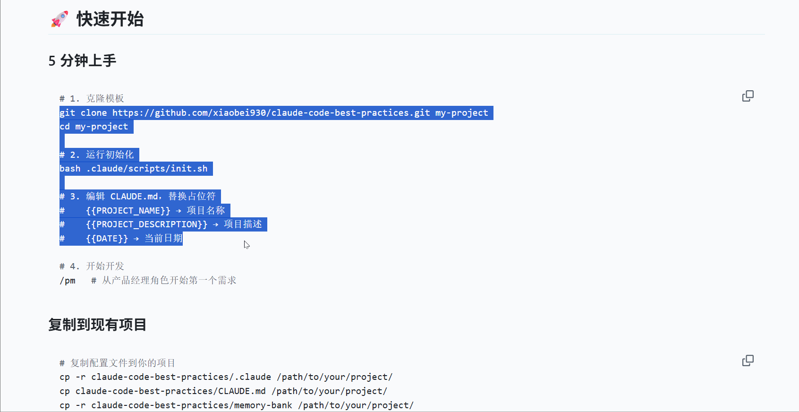
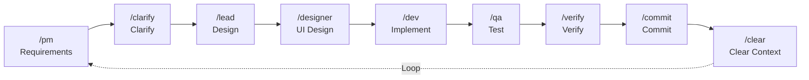

# Claude Code Best Practices

<p align="center">
  <strong>🚀 Install → Configure → Code</strong>
</p>

<p align="center">
  <a href="https://opensource.org/licenses/MIT"></a>
  <a href="https://github.com/xiaobei930/claude-code-best-practices/releases"></a>
  <a href="https://github.com/xiaobei930/claude-code-best-practices/actions/workflows/validate-template.yml"></a>
</p>

<p align="center">
  <a href="https://github.com/xiaobei930/claude-code-best-practices/stargazers"></a>
  <a href="https://github.com/xiaobei930/claude-code-best-practices/network/members"></a>
  <a href="https://github.com/xiaobei930/claude-code-best-practices/commits"></a>
</p>

<p align="center">
  <strong>English</strong> | <a href="README.zh-CN.md">中文</a>
</p>

---

> **Install as plugin and start coding with Claude in minutes, not hours.**

A production-ready Claude Code plugin & template for development teams. Includes **30+ commands**, **14 skills**, **6 agents**, and **safety hooks** with support for **Python / Vue / TypeScript / C++ / Java / C# / Go**.

### ✨ Highlights

- 🎭 **Role-based workflow**: PM → Lead → Dev → QA pipeline
- 🔄 **Autonomous mode**: `/iterate` runs tasks without intervention
- 🛡️ **Safety hooks**: Blocks dangerous commands, protects files
- 📝 **Memory bank**: Persists progress across sessions with auto-archive
- 🌍 **Bilingual**: Full documentation in English & Chinese

## 📑 Table of Contents

- [Why This Template?](#why-this-template)
- [Quick Start](#-quick-start)
- [Core Features](#-core-features)
- [Directory Structure](#-directory-structure)
- [Workflow](#-workflow)
- [Command Reference](#-command-reference)
- [Skills](#-skills)
- [Agents](#-agents)
- [Plugin Compatibility](#-plugin-compatibility)
- [Customization Guide](#-customization-guide)
- [Best Practices](#-best-practices)
- [FAQ](#-faq)
- [Requirements](#-requirements)
- [References](#-references)

---

## Why This Template?

| Without Template                      | With Template                        |
| ------------------------------------- | ------------------------------------ |
| ❌ Configure Claude Code from scratch | ✅ Ready to use out of the box       |
| ❌ Inconsistent code style            | ✅ Enforced coding standards         |
| ❌ Manual repetitive workflows        | ✅ Role-based automation (PM→Dev→QA) |
| ❌ Risk of dangerous commands         | ✅ Safety hooks protect your system  |
| ❌ Context lost between sessions      | ✅ Memory bank persists progress     |

### Demo

<p align="center">
  
  <br>
  <em>Plugin commands in action</em>
</p>

---

## 🚀 Quick Start

### Option 1: Install as Plugin (Recommended)

The easiest way to use this repo - install as a Claude Code plugin:

```bash
# In Claude Code, run:
/plugin

# Select "Add Marketplace", then enter:
xiaobei930/claude-code-best-practices

# Then select "Install Plugin" and choose:
cc-best
```

Or use direct commands:

```bash
# Add this repo as a marketplace
/plugin marketplace add xiaobei930/claude-code-best-practices

# Install the plugin
/plugin install cc-best@xiaobei930
```

Or add directly to your `~/.claude/settings.json`:

```json
{
  "extraKnownMarketplaces": {
    "claude-code-best-practices": {
      "source": {
        "source": "github",
        "repo": "xiaobei930/claude-code-best-practices"
      }
    }
  },
  "enabledPlugins": {
    "cc-best@xiaobei930": true
  }
}
```

This gives you instant access to all commands, agents, skills, and hooks.

<details>
<summary>📹 See installation in action</summary>
<br>
<p align="center">
  
</p>
</details>

#### Update Plugin

```bash
# Update to the latest version
/plugin update cc-best@xiaobei930
```

> **Note**: `/plugin marketplace update` only refreshes the available plugins list, it does NOT update installed plugins. Use `/plugin update` to get the latest version.

#### Plugin Configuration

After installing as a plugin:

1. **Override plugin settings** by creating local files:
   - Create `commands/` in your project to add/override commands
   - Create `rules/` to add project-specific rules

2. **Memory bank**: Plugin doesn't include memory-bank. Create manually if needed:

```bash
mkdir -p memory-bank
touch memory-bank/progress.md
touch memory-bank/architecture.md
```

3. **Hookify rules**: Plugin's hookify rules (`.claude/hookify.*.local.md`) won't auto-apply to your project. The core safety features are provided by `hooks/hooks.json` instead.

---

### Option 2: Clone Template (Full Customization)

For new projects where you want full control:

```bash
# 1. Clone the template
git clone https://github.com/xiaobei930/claude-code-best-practices.git my-project
cd my-project

# 2. Run initialization
bash scripts/shell/init.sh

# 3. Edit CLAUDE.md and replace placeholders
#    {{PROJECT_NAME}} → Your project name
#    {{PROJECT_DESCRIPTION}} → Project description
#    {{DATE}} → Current date

# 4. Start developing
/pm   # Begin with the Product Manager role for your first requirement
```

#### Copy to Existing Project

```bash
# Copy configuration files to your project
cp -r claude-code-best-practices/.claude /path/to/your/project/
cp -r claude-code-best-practices/commands /path/to/your/project/
cp -r claude-code-best-practices/skills /path/to/your/project/
cp -r claude-code-best-practices/agents /path/to/your/project/
cp -r claude-code-best-practices/rules /path/to/your/project/
cp -r claude-code-best-practices/scripts /path/to/your/project/
cp -r claude-code-best-practices/hooks /path/to/your/project/
cp -r claude-code-best-practices/memory-bank /path/to/your/project/
cp claude-code-best-practices/CLAUDE.md /path/to/your/project/

# Navigate to your project and initialize
cd /path/to/your/project
bash scripts/shell/init.sh
```

> **Windows Users**: Use Git Bash to run scripts, or use `robocopy` to copy files.

**Migrating from an existing project?** See [MIGRATION.md](MIGRATION.md).

---

### Plugin vs Clone: When to Use Which

| Method             | Best For          | What You Get                                    |
| ------------------ | ----------------- | ----------------------------------------------- |
| **Install Plugin** | Existing projects | Commands, skills, agents, hooks added instantly |
| **Clone Template** | New projects      | Full customization, all files in your repo      |

> **Note**: Don't install the plugin in a project that was cloned from this template - it will cause duplicate commands and hooks.

---

## ✨ Core Features

### 🎭 Role-Based Workflow

PM → Lead → Dev → QA → Commit complete development cycle, each role with clear responsibilities.

### 🔄 Autonomous Iteration Mode

`/iterate` mode lets Claude autonomously complete task lists without frequent intervention.

<details>
<summary>📹 See /iterate in action</summary>
<br>
<p align="center">
  
</p>
</details>

### 🛡️ Safety Hooks

Pre-configured guards against dangerous operations: blocks `rm -rf /`, `git push --force`, and other risky commands.

### 📐 Multi-Language Standards

Coding standards for 7+ languages: Python, Vue/TS, C++, Java, C#, Go, and more.

### 🧠 Memory Bank

`memory-bank/` directory persists project progress, architecture decisions, and tech stack choices.

**Auto-archiving**: `progress.md` uses rolling window strategy to prevent file bloat:

- Keeps only recent 5 completed tasks, 5 decisions, 5 checkpoints
- Old records auto-archive to `progress-archive.md`
- Run `/checkpoint --archive` when file exceeds 300 lines

### 🌐 Cross-Platform Support

Node.js-based hooks and utilities for Windows/macOS/Linux compatibility. Auto-detects package manager (npm/pnpm/yarn/bun).

### 🔌 MCP Integration

Ready-to-use MCP server configurations supporting memory, playwright, firecrawl, and more.

---

## 📁 Directory Structure

```
your-project/
├── CLAUDE.md                   # Project constitution (must keep)
├── memory-bank/                # Project memory bank
│   ├── progress.md             # Progress tracking (rolling window)
│   ├── progress-archive.md     # Historical records archive
│   ├── architecture.md         # Architecture documentation
│   └── tech-stack.md           # Technology choices
│
├── commands/                   # Slash commands (30+)
│   ├── pm.md, lead.md          # Role commands
│   ├── iterate.md, pair.md     # Mode commands
│   └── build.md, test.md       # Tool commands
│
├── rules/                      # Coding standards (13 files)
│   ├── methodology.md          # Development methodology
│   ├── coding-standards.md     # Universal standards
│   ├── code-style.md           # Python style
│   ├── frontend-style.md       # Vue/TS/JS style
│   └── security.md             # Security rules
│
├── skills/                     # Development skills (14 categories)
│   ├── backend-patterns/       # Backend patterns
│   ├── frontend-patterns/      # Frontend patterns
│   ├── devops-patterns/        # DevOps patterns
│   └── tdd-workflow/           # TDD workflow
│
├── agents/                     # Sub-agents (6)
│   ├── code-reviewer.md        # Code review
│   └── security-reviewer.md    # Security review
│
├── scripts/                    # Automation scripts (by language)
│   ├── shell/                  # Bash scripts (10)
│   │   ├── init.sh, cleanup.sh
│   │   └── session-start.sh, session-end.sh
│   ├── python/                 # Python scripts (9)
│   │   ├── validate-command.py, protect-files.py
│   │   └── format-file.py, check-console-log.py
│   └── node/                   # Node.js (default, cross-platform)
│       ├── lib/                # Utilities
│       │   ├── utils.js        # 27 helper functions
│       │   └── package-manager.js
│       ├── verify-hooks.js     # Hook configuration verifier
│       ├── archive-progress.js # Progress file archiver
│       └── hooks/              # 13 lifecycle hooks
│           ├── validate-command.js, protect-files.js
│           ├── session-start.js, session-end.js
│           └── format-file.js, typescript-check.js
│
├── hooks/                      # Hook configuration
│   └── hooks.json              # Plugin hooks config
│
└── .claude/                    # Claude Code configuration
    ├── settings.json           # Base permissions (commit to Git)
    ├── settings.local.json     # Local config + Hooks (don't commit)
    ├── mcp-configs/            # MCP server configurations
    ├── ralph-prompts/          # Ralph Loop prompts
    └── learned/                # Continuous learning storage
```

---

## 🔄 Workflow

### Standard Development Cycle



### Three Development Modes

| Mode                     | Command       | Use Case                       | Characteristics                                |
| ------------------------ | ------------- | ------------------------------ | ---------------------------------------------- |
| **Autonomous Iteration** | `/iterate`    | Clear task list                | Fully autonomous, no intervention needed       |
| **Pair Programming**     | `/pair`       | Learning, sensitive operations | Confirm each step, human-machine collaboration |
| **Long-Running Loop**    | `/ralph-loop` | Hour-level batch tasks         | Requires plugin installation                   |

---

## 📋 Command Reference

### Role Commands

| Command     | Role                 | Responsibilities                                         |
| ----------- | -------------------- | -------------------------------------------------------- |
| `/pm`       | Product Manager      | Requirement analysis, user stories, acceptance criteria  |
| `/lead`     | Tech Lead            | Technical design, task breakdown, architecture decisions |
| `/dev`      | Developer            | Code implementation, unit tests                          |
| `/qa`       | QA Engineer          | Functional verification, test cases                      |
| `/designer` | UI Designer          | Design guidance, interface specifications                |
| `/clarify`  | Clarification Expert | Requirement clarification, boundary confirmation         |

### Mode Commands

| Command     | Description                                                                                               |
| ----------- | --------------------------------------------------------------------------------------------------------- |
| `/iterate`  | Autonomous iteration loop, reads progress.md and executes tasks automatically                             |
| `/pair`     | Pair programming mode, continues after confirming each key step                                           |
| `/cc-ralph` | Start Ralph Loop with cc-best workflow (requires ralph-loop plugin). Supports `--mode`, `--setup` options |

### Tool Commands

| Command       | Function                                              |
| ------------- | ----------------------------------------------------- |
| `/build`      | Build project                                         |
| `/test`       | Run tests                                             |
| `/run`        | Start development server                              |
| `/commit`     | Git commit                                            |
| `/pr`         | Create Pull Request                                   |
| `/git`        | Git commit conventions                                |
| `/status`     | View project status                                   |
| `/checkpoint` | Create checkpoint                                     |
| `/compact`    | Compress context                                      |
| `/context`    | Context management                                    |
| `/memory`     | Project memory management                             |
| `/verify`     | Verify code quality                                   |
| `/setup`      | Project initialization (`--verify` to diagnose hooks) |
| `/fix`        | Fix build errors                                      |
| `/docs`       | Sync documentation                                    |

### Auxiliary Commands

| Command       | Function                    |
| ------------- | --------------------------- |
| `/catchup`    | Quick context recovery      |
| `/cleanup`    | Dead code cleanup           |
| `/learn`      | Session learning            |
| `/self-check` | Self-check validation       |
| `/task`       | Task granularity management |
| `/infer`      | Model inference             |
| `/train`      | Model training              |
| `/setup-pm`   | Package manager setup       |

---

## 🛠️ Skills

| Skill                 | Purpose                 | Key Contents                                             |
| --------------------- | ----------------------- | -------------------------------------------------------- |
| `backend-patterns`    | Backend development     | Generic patterns + Python/TS/Java/Go/C#/Rust subfiles    |
| `frontend-patterns`   | Frontend development    | Generic patterns + Vue/React/Svelte/Angular subfiles     |
| `devops-patterns`     | DevOps practices        | CI/CD pipelines, Docker, deployment strategies           |
| `tdd-workflow`        | Test-driven development | Red-Green-Refactor cycle                                 |
| `api-development`     | API development         | RESTful design, response formats, authentication         |
| `database-patterns`   | Database design         | Naming conventions, query optimization, migrations       |
| `security-review`     | Security review         | OWASP checklist, vulnerability protection                |
| `debugging`           | Systematic debugging    | Problem localization, log analysis, profiling            |
| `git-workflow`        | Git workflow            | Branch strategy, commit conventions, conflict resolution |
| `isolated-research`   | Deep code research      | Isolated context exploration without polluting session   |
| `continuous-learning` | Continuous learning     | Session evaluation, knowledge extraction                 |
| `strategic-compact`   | Strategic compression   | Compression timing, best practices                       |

---

## 🏗️ Layered Architecture: Commands / Skills / Agents

This template uses a three-tier architecture, each with different responsibilities and triggers:

### Layer Comparison

| Layer        | Directory   | Trigger Method           | Responsibility                                | Detail Level |
| ------------ | ----------- | ------------------------ | --------------------------------------------- | ------------ |
| **Commands** | `commands/` | User invokes `/xxx`      | Role-playing, full workflow, context handoff  | Complete     |
| **Skills**   | `skills/`   | Auto-inject or reference | Reference docs, best practices, code examples | Detailed     |
| **Agents**   | `agents/`   | Task tool delegation     | Sub-agent execution, isolated context         | Concise      |

### Trigger Conditions

#### Commands (User-Initiated)

Triggered when user types `/command`:

- **Role switch**: `/pm`, `/lead`, `/dev`, `/qa`, `/designer`
- **Workflow start**: `/iterate`, `/pair`
- **Tool execution**: `/build`, `/test`, `/commit`

#### Skills (Context Injection)

Claude auto-loads relevant skills, or pre-loads via agent frontmatter:

- **Auto-load**: Load `api-development` when implementing APIs
- **Explicit reference**: `skills: [tdd-workflow]` in agent
- **User request**: `Check code using security-review skill`

#### Agents (Task Tool Delegation)

Delegated by Claude via Task tool when appropriate:

- **Code review**: After code changes → `code-reviewer`
- **Security check**: Auth/input involved → `security-reviewer`
- **TDD guidance**: Tests needed → `tdd-guide`
- **Task planning**: Complex features → `planner`

### Usage Example

```
User: Implement user login feature

Claude behavior:
1. /lead role → Design solution
2. Load api-development + security-review skills
3. /dev role → Coding implementation
4. Delegate tdd-guide agent → Write tests
5. Delegate security-reviewer agent → Security check
6. /qa role → Acceptance testing
```

---

## 🤖 Agents

Sub-agents for specialized tasks, automatically invoked by the Task tool.

| Agent                   | Purpose                | Auto-Trigger Condition                                |
| ----------------------- | ---------------------- | ----------------------------------------------------- |
| `code-reviewer`         | Code review            | After code changes for quality/architecture checks    |
| `code-simplifier`       | Code simplification    | Post-feature cleanup, dead code removal               |
| `planner`               | Task planning          | Complex feature implementation, architectural changes |
| `requirement-validator` | Requirement validation | Validate requirement docs before design phase         |
| `security-reviewer`     | Security review        | Auth, user input, secrets, API endpoints involved     |
| `tdd-guide`             | TDD guidance           | New features, bug fixes, test-first methodology       |

### Agent Invocation

Agents are invoked via Task tool or through command handoffs:

```
Task:
  subagent_type: "code-reviewer"
  prompt: "Review code quality"
```

> **Note**: Use agent name directly (e.g., `code-simplifier`). Works for both plugin install and clone install.

---

## 🔌 Plugin Compatibility

This template is designed to work seamlessly with official Claude Code plugins. Our built-in agents and skills complement (not replace) official plugins.

### Relationship with Official Plugins

| Template Content          | Official Plugin      | Relationship                                                                 |
| ------------------------- | -------------------- | ---------------------------------------------------------------------------- |
| `code-reviewer` agent     | `code-review` plugin | Template: lightweight local version; Plugin: more powerful with auto-trigger |
| `security-reviewer` agent | `security-guidance`  | Template: OWASP checklist; Plugin: automatic security analysis               |
| `code-simplifier` agent   | `code-simplifier`    | Similar function; plugin has more context                                    |
| `/iterate` command        | `ralph-loop` plugin  | Template: single session; Plugin: cross-session persistence                  |
| `hookify` examples        | `hookify` plugin     | Template: examples; Plugin: full hook management                             |

### Recommended Plugin Configuration

```json
{
  "enabledPlugins": {
    "code-review@claude-plugins-official": true,
    "hookify@claude-plugins-official": true,
    "security-guidance@claude-plugins-official": true
  }
}
```

### When to Use Which

- **No plugins installed**: Template agents/skills work standalone
- **With plugins**: Use plugins for advanced features, template for quick local checks
- **Best practice**: Install plugins, use template agents for immediate feedback, plugins for deep analysis

---

## ⚙️ Customization Guide

### Adding New Rules

Create a file in `rules/`:

```markdown
---
paths:
  - "**/*.your-ext"
---

# Rule Title

## Rule Content

...
```

### Adding New Commands

Create a file in `commands/`:

```markdown
---
allowed_tools:
  - Read
  - Edit
  - Write
  - Bash
---

# /your-command - Command Name

## Responsibilities

...

## Execution Steps

1. ...
2. ...
```

### Configuring Hooks

Edit `.claude/settings.local.json`:

```json
{
  "hooks": {
    "PreToolUse": [
      {
        "matcher": "Bash",
        "hooks": [
          {
            "type": "command",
            "command": "python scripts/your-script.py",
            "timeout": 5
          }
        ]
      }
    ]
  }
}
```

### Pre-configured Hooks

> ⚠️ **Important: Hooks Require Manual Setup**
>
> Due to a [known Claude Code issue](https://github.com/anthropics/claude-code/issues/9354), plugin hooks are **disabled by default**. To enable the safety guards and automation hooks, run:
>
> ```bash
> /setup --hooks
> ```
>
> This command configures hooks with absolute paths. See the [FAQ](#hook-issues) for more details.

All hooks default to Node.js for cross-platform compatibility. Python/Bash alternatives available.

| Trigger      | Function                    | Script (Node.js)       |
| ------------ | --------------------------- | ---------------------- |
| PreToolUse   | Validate dangerous commands | `validate-command.js`  |
| PreToolUse   | Confirm before git push     | `pause-before-push.js` |
| PreToolUse   | Protect sensitive files     | `protect-files.js`     |
| PreToolUse   | Block random .md creation   | `block-random-md.js`   |
| PostToolUse  | Auto-format code            | `format-file.js`       |
| PostToolUse  | Check console.log           | `check-console-log.js` |
| PostToolUse  | TypeScript type check       | `typescript-check.js`  |
| SessionStart | Session health check        | `session-check.js`     |
| SessionStart | Load previous context       | `session-start.js`     |
| PreCompact   | Save state before compact   | `pre-compact.js`       |
| SessionEnd   | Session end persistence     | `session-end.js`       |

---

## 💡 Best Practices

### 1. Keep CLAUDE.md Concise

- Keep it under 100 lines
- Put detailed specifications in `rules/`

### 2. Use the Memory Bank

- Update `progress.md` after each task completion
- Record important decisions in `architecture.md`

### 3. Context Management

- Normal mode: Use `/clear` frequently to avoid context overflow
- `/iterate` mode: Don't clear manually, maintain loop continuity

### 4. Don't Overload MCP

- Enable no more than 10 MCP servers per project
- Use `disabledMcpServers` to disable unused ones

### 5. Regular Cleanup

- Delete unused language rules
- Remove unused commands

### 6. MCP Temporary Directory Management

MCP tools auto-create temporary directories in your project:

| Directory              | Source           | Purpose                                 |
| ---------------------- | ---------------- | --------------------------------------- |
| `.playwright-mcp/`     | MCP auto-created | Playwright MCP temporary files          |
| `.claude/mcp-data/`    | MCP auto-created | MCP shared data                         |
| `*-mcp/`               | MCP auto-created | Other MCP tool directories              |
| `.claude/screenshots/` | Template-defined | Manually saved screenshots (meaningful) |

**Cleanup Script**: Use `cleanup.sh` for regular maintenance:

```bash
# Preview files to delete (dry run)
bash scripts/shell/cleanup.sh --dry-run

# Clean files older than 7 days (default)
bash scripts/shell/cleanup.sh

# Clean files older than 3 days
bash scripts/shell/cleanup.sh --days 3

# Clean all MCP temporary files
bash scripts/shell/cleanup.sh --all
```

---

## ❓ FAQ

### Getting Started

<details>
<summary><strong>Q: Can I delete files I don't need?</strong></summary>

Yes! Commonly deletable files:

- `.github/` - If you don't need contribution templates
- `CONTRIBUTING.md`, `CHANGELOG.md`, `FAQ.md` - Template-specific docs
- Unused language rules (e.g., Python projects can delete `cpp-style.md`)

Minimum to keep:

- `CLAUDE.md` - Core configuration
- `.claude/settings.json` - Permission settings
- Language rules you actually use
</details>

<details>
<summary><strong>Q: Do I need to keep the Git history?</strong></summary>

No. For a fresh start:

```bash
rm -rf .git
git init
git add .
git commit -m "Initial commit from Claude Code template"
```

</details>

### Hook Issues

<details>
<summary><strong>Q: Hooks not working? (Clone users)</strong></summary>

1. Check if `settings.local.json` exists:

   ```bash
   ls .claude/settings.local.json
   ```

   If not:

   ```bash
   cp .claude/settings.local.json.example .claude/settings.local.json
   ```

2. Check script permissions (Linux/Mac):

   ```bash
   chmod +x scripts/*.sh
   chmod +x scripts/*.py
   ```

3. Check Claude Code version - hooks require recent versions

4. Run `/setup --verify` to diagnose hook configuration issues
</details>

<details>
<summary><strong>Q: How to diagnose hook configuration issues?</strong></summary>

Run the hook verification command:

```bash
/setup --verify
```

This will check:

- Script paths exist
- Timeout values are valid (1s - 600s)
- Matcher syntax is correct
- Lifecycle events are valid

Output includes diagnostic report and fix suggestions.

</details>

<details>
<summary><strong>Q: Hooks error "Cannot find module" (Plugin users)</strong></summary>

This is a [known Claude Code issue](https://github.com/anthropics/claude-code/issues/9354). The `${CLAUDE_PLUGIN_ROOT}` environment variable may not expand correctly.

**Solutions:**

1. **Run `/setup --hooks` (Recommended)**: This command automatically detects your environment and configures hooks with absolute paths

   ```bash
   /setup --hooks --global  # Configure to global settings
   /setup --hooks --project # Configure to project settings
   ```

2. **Use Clone method instead**: Clone this repository and copy files to your project

3. **Wait for official fix**: Track [Issue #9354](https://github.com/anthropics/claude-code/issues/9354) for updates
</details>

<details>
<summary><strong>Q: "SessionStart:startup hook error" on Windows</strong></summary>

This error is often caused by **official plugins** (superpowers, learning-output-style, etc.) that also use `${CLAUDE_PLUGIN_ROOT}`.

**Solutions:**

1. **Clear problematic plugin hooks** (run in Git Bash):

   ```bash
   # Clear superpowers SessionStart hooks
   find ~/.claude/plugins/cache/claude-plugins-official/superpowers -name "hooks.json" \
     -exec sh -c 'cat {} | jq ".hooks.SessionStart = []" > {}.tmp && mv {}.tmp {}' \;

   # Clear learning-output-style SessionStart hooks
   find ~/.claude/plugins/cache/claude-plugins-official/learning-output-style -name "hooks.json" \
     -exec sh -c 'cat {} | jq ".hooks.SessionStart = []" > {}.tmp && mv {}.tmp {}' \;
   ```

2. **Clear old cc-best plugin cache** (if errors persist):

   ```bash
   # Clear old version hooks
   find ~/.claude/plugins/cache/claude-code-best-practices -name "hooks.json" \
     -exec sh -c 'echo "{\"hooks\":{}}" > {}' \;
   ```

3. **Verify fix**: Restart Claude Code - error should be gone

> **Note**: These changes may be overwritten when plugins update. Re-run if errors return.

</details>

<details>
<summary><strong>Q: format_file.py encoding error</strong></summary>

Common Windows issue. Solutions:

1. Ensure Python 3.8+ is installed
2. Set environment variable: `PYTHONUTF8=1`
</details>

### Command Issues

<details>
<summary><strong>Q: What's the difference between /iterate and /pair?</strong></summary>

| Mode       | Control           | Use Case                       |
| ---------- | ----------------- | ------------------------------ |
| `/iterate` | Fully autonomous  | Clear task list                |
| `/pair`    | Confirm each step | Learning, sensitive operations |

</details>

<details>
<summary><strong>Q: /iterate stopped unexpectedly</strong></summary>

Check stop conditions:

- User interrupt (Ctrl+C)
- All tasks in `progress.md` completed
- Fatal error occurred
- User decision required

Recovery: Run `/iterate` again

</details>

<details>
<summary><strong>Q: Command not found</strong></summary>

- Confirm file is in `commands/` directory
- Confirm file extension is `.md`
- Restart Claude Code
</details>

### MCP Issues

<details>
<summary><strong>Q: How to configure MCP servers?</strong></summary>

Edit `.claude/settings.local.json`:

```json
{
  "enabledMcpjsonServers": ["memory", "sequential-thinking"]
}
```

Then restart Claude Code.

</details>

<details>
<summary><strong>Q: Too many MCP tools causing issues</strong></summary>

Best practice: Enable no more than 10 per project.

```json
{
  "disabledMcpServers": ["github", "vercel"]
}
```

</details>

### Troubleshooting

<details>
<summary><strong>Q: "Permission denied" error</strong></summary>

```bash
# Linux/Mac
chmod +x scripts/*.sh
chmod +x scripts/*.py

# Windows: Run as Administrator
```

</details>

<details>
<summary><strong>Q: Rule changes not taking effect</strong></summary>

- Claude Code caches rules at session start
- Restart session or use `/clear` after modifications
</details>

---

## 🔧 Requirements

| Dependency    | Version            | Notes                              |
| ------------- | ------------------ | ---------------------------------- |
| Claude Code   | Latest recommended | Hooks require recent versions      |
| Node.js       | 16+                | For cross-platform hooks (default) |
| Python        | 3.8+               | For some hook scripts              |
| Bash/Git Bash | Any version        | Optional for bash hooks            |

### Optional MCP Servers

Some commands use MCP (Model Context Protocol) tools for enhanced functionality:

| MCP Server | Used By                    | Purpose                                           |
| ---------- | -------------------------- | ------------------------------------------------- |
| Playwright | `/designer`, `/dev`, `/pm` | Browser automation for UI testing and screenshots |
| Firecrawl  | `/pm`, `/lead`             | Web scraping for requirement research             |

> **Note**: These are optional. Commands work without MCP servers but with reduced functionality.
> Install via Claude Code settings: `Settings > MCP Servers`

### Supported Languages

| Language  | Rule File                | Formatter          | Test Framework |
| --------- | ------------------------ | ------------------ | -------------- |
| Python    | `code-style.md`          | Black + isort      | pytest         |
| Vue/TS/JS | `frontend-style.md`      | Prettier           | Vitest         |
| C++       | `cpp-style.md`           | clang-format       | Google Test    |
| Java      | `java-style.md`          | google-java-format | JUnit          |
| C#        | `csharp-style.md`        | dotnet format      | xUnit/NUnit    |
| Go        | `backend-patterns/go.md` | gofmt              | testing        |

---

## 📚 References

### Official Resources

- [Anthropic Official Best Practices](https://www.anthropic.com/engineering/claude-code-best-practices)
- [CLAUDE.md Complete Guide](https://www.builder.io/blog/claude-md-guide)

### Community Projects

- [everything-claude-code](https://github.com/affaan-m/everything-claude-code) - Claude Code resource collection
- [vibe-coding-cn](https://github.com/2025Emma/vibe-coding-cn) - Chinese Vibe Coding guide

---

## 🌐 Note on Internal Files

This template's internal files (`commands/`, `rules/`, `skills/`) are written in **Chinese**. This is intentional:

- **Claude understands Chinese** - All Claude models can read and follow Chinese instructions perfectly
- **No translation burden** - Maintaining dual-language internal files would be impractical
- **Focus on users** - The README (this file) is fully English for international users

If you prefer English internal files, community contributions for English translations are welcome!

---

## 🤝 Contributing

Contributions are welcome! See [CONTRIBUTING.md](CONTRIBUTING.md) for details.

| Contribution Type  | Description                                                      |
| ------------------ | ---------------------------------------------------------------- |
| ⭐ Star            | Show your support                                                |
| 🐛 Bug Report      | [Report issues](../../issues/new?template=bug_report.md)         |
| 💡 Feature Request | [Suggest features](../../issues/new?template=feature_request.md) |
| 📝 Documentation   | Improve docs                                                     |
| 🔧 Code            | Add commands, rules, skills                                      |

---

## 📄 License

[MIT License](LICENSE) - Free to use and modify

---

<p align="center">
  <strong>If this template helps you, please give it a ⭐ Star!</strong>
</p>
