# CC-Best

<p align="center">
  <strong>Role-Driven Development Workflow for Claude Code</strong>
</p>

<p align="center">
  <a href="https://opensource.org/licenses/MIT"></a>
  <a href="https://github.com/xiaobei930/cc-best/releases"></a>
  <a href="https://github.com/xiaobei930/cc-best/actions/workflows/validate-plugin.yml"></a>
  <a href="https://github.com/xiaobei930/cc-best/stargazers"></a>
  <a href="https://xiaobei930.github.io/cc-best/"></a>
</p>

<p align="center">
  <strong>English</strong> | <a href="README.zh-CN.md">中文</a> | <a href="https://xiaobei930.github.io/cc-best/">🌐 Homepage</a>
</p>

---

> **Transform Claude into a complete development team.**
> From product requirements to code review — one plugin, full workflow.

<p align="center">
  <code>40 commands</code> · <code>17 skills</code> · <code>8 agents</code> · <code>33 rules</code> · <code>18 hooks</code>
</p>

<p align="center">
  
</p>

<p align="center">
  <a href="#-quick-start">Quick Start</a> •
  <a href="#-core-features">Features</a> •
  <a href="#-workflow">Workflow</a> •
  <a href="#-command-reference">Commands</a> •
  <a href="#-faq">FAQ</a>
</p>

### Why CC-Best?

🎯 **The Problem**: Claude Code is powerful, but configuring workflows, coding standards, and safety rules from scratch takes hours.

✨ **The Solution**: Pre-configured roles (PM → Lead → Designer → Dev → QA) that mirror real team collaboration, with safety guardrails built-in.

## ⚡ Quick Start

```bash
# Add marketplace and install
/plugin marketplace add xiaobei930/cc-best
/plugin install cc-best@xiaobei930

# Verify installation (30 seconds)
/cc-best:status

# Start using
/cc-best:iterate "implement user authentication"
```

> 💡 **Enable Hooks**: After installation, run `/cc-best:setup --hooks` to activate safety guards and automation hooks.
> See [Hooks Configuration](#pre-configured-hooks) for details.

### Plugin vs Clone: Command Format

| Installation  | Command format     | Example                          |
| ------------- | ------------------ | -------------------------------- |
| **Plugin** ⭐ | `/cc-best:command` | `/cc-best:iterate "add feature"` |
| **Clone**     | `/command`         | `/iterate "add feature"`         |

> 💡 **Recommended**: Install via plugin for automatic updates and easier management.
> All documentation uses plugin format (`/cc-best:xxx`). Clone users: run `convert-to-local.js`.

<p align="center">
  
</p>

<details>
<summary>📦 Alternative: Clone for full customization</summary>

```bash
git clone https://github.com/xiaobei930/cc-best.git .claude
cd .claude && bash scripts/shell/init.sh

# Convert command format from /cc-best:xxx to /xxx
node scripts/node/convert-to-local.js
```

Use clone when you need to customize all files in your repo.

> ⚠️ **Important**: All documentation uses plugin format (`/cc-best:xxx`).
> Run the conversion script to update to local format (`/xxx`).

</details>

<details>
<summary>🗑️ Uninstall</summary>

```bash
# Remove the plugin
/plugin uninstall cc-best@xiaobei930

# Remove marketplace (optional)
/plugin marketplace remove xiaobei930/cc-best
```

No files are left behind.

</details>

### What Happens Next?

After running `/cc-best:iterate "implement user authentication"`, Claude will:

```
1. 📋 /cc-best:pm     → Analyze requirements, create task breakdown
2. 🏗️ /cc-best:lead   → Design technical solution
3. 💻 /cc-best:dev    → Write code, create tests
4. 🧪 /cc-best:qa     → Run tests, verify quality
5. ✅ /cc-best:commit → Commit changes with proper message
```

You just watch. Intervene only when needed.

### Common Workflows

| I want to...       | Command                                      | What Claude does                           |
| ------------------ | -------------------------------------------- | ------------------------------------------ |
| Build a feature    | `/cc-best:iterate "add dark mode toggle"`    | Full cycle: plan → code → test → commit    |
| Fix a bug          | `/cc-best:iterate "fix login timeout issue"` | Investigate → fix → verify → commit        |
| Review code        | `/cc-best:pm "review recent changes"`        | Analyze code, suggest improvements         |
| Learn the codebase | `/cc-best:pair`                              | Step-by-step exploration with explanations |

### Who Is This For?

| You are...                   | Recommended mode   | Why                                            |
| ---------------------------- | ------------------ | ---------------------------------------------- |
| **Team with multiple roles** | Full workflow      | PM → Lead → Dev → QA mirrors your process      |
| **Solo developer**           | `/cc-best:iterate` | Let Claude handle the boring parts             |
| **Learning Claude Code**     | `/cc-best:pair`    | Understand each step before proceeding         |
| **Need quick fixes**         | Direct commands    | `/cc-best:dev "fix the typo"` for simple tasks |

---

## ✨ Core Features

| Feature                         | What it does                                                                    |
| ------------------------------- | ------------------------------------------------------------------------------- |
| 🎭 **Role-Based Workflow**      | PM → Lead → Designer → Dev → QA — complete development cycle                    |
| 🔄 **Autonomous Mode**          | `/cc-best:iterate` runs tasks without intervention until completion             |
| 🛡️ **Safety Hooks**             | Blocks `rm -rf /`, `git push --force`, and other risky commands                 |
| 📐 **Multi-Language Standards** | 8-dir layered structure: common + Python/frontend/Java/C#/C++/embedded/UI rules |
| 🧠 **Memory Bank**              | Persists progress and decisions across sessions                                 |
| 👥 **Pair Programming**         | `/cc-best:pair` — step-by-step collaboration with 5 confirmation checkpoints    |
| 🔗 **Knowledge Pipeline**       | observe → analyze → learn → evolve — self-improving knowledge loop              |
| 🌐 **Cross-Platform**           | Windows, macOS, Linux — auto-detects package manager                            |

> While CC-Best is built for Claude Code, the methodology (Dao-Fa-Shu-Qi) and role-driven patterns are framework-agnostic and can be adapted for other AI coding assistants.

### What Makes CC-Best Different

<details>
<summary><strong>🎭 Role-Driven Development Pipeline</strong></summary>

Not just a prompt template collection — CC-Best simulates real team collaboration:

- **7 roles** with clear boundaries: PM → Lead → Designer → Dev → QA → Verify → Commit
- Each role has explicit **MUST/SHOULD/NEVER** rules, output templates, and handoff protocols
- **Automatic flow**: PM creates REQ → Lead reviews & creates DES/TSK → Dev implements → QA validates
- **Downstream correction (A3)**: Lead can adjust PM decisions; QA distinguishes implementation bugs from requirement assumption errors
- **Document traceability**: REQ-XXX → DES-XXX → TSK-XXX numbered chain

</details>

<details>
<summary><strong>🔄 Autonomous Iteration Engine</strong></summary>

`/cc-best:iterate` enables fully autonomous development:

```
Read progress.md → Select role → Execute → Verify → Commit → Next task (no waiting)
```

- **Smart role selection**: 8 state conditions determine which role activates
- **A1-A5 decision principles**: Context inference (A1), decision recording (A2), downstream correction (A3), MVP fallback (A4), issue classification (A5)
- **4 strict stop conditions**: All tasks done, user interrupt, fatal error, external dependency
- **Cross-session continuity**: memory-bank + progress.md rolling window

</details>

<details>
<summary><strong>🔗 Self-Evolving Knowledge Pipeline</strong></summary>

CC-Best learns from your development patterns:

```
observe → analyze → learn → evolve
```

- **observe**: `observe-patterns.js` hook automatically tracks tool usage patterns
- **analyze**: `/cc-best:analyze` mines git history and usage data
- **learn**: `/cc-best:learn` extracts reusable knowledge
- **evolve**: `/cc-best:evolve` generates new commands, skills, or agents from learned patterns

</details>

---

## 📁 Directory Structure

```
your-project/
├── CLAUDE.md          # Project constitution
├── commands/          # 38 slash commands
├── skills/            # 17 development skills
├── agents/            # 8 specialized agents
├── rules/             # 33 coding standards (8 dirs)
├── hooks/             # Safety hooks
├── scripts/           # Automation (node/python/shell)
├── memory-bank/       # Progress & architecture docs
└── .claude/           # Claude Code config
```

<details>
<summary>📂 Detailed structure</summary>

| Directory      | Contents                                                                                                                                      |
| -------------- | --------------------------------------------------------------------------------------------------------------------------------------------- |
| `commands/`    | Role commands (`pm`, `lead`, `dev`, `qa`), Mode commands (`iterate`, `pair`), Tool commands (`build`, `test`, `commit`)                       |
| `skills/`      | Backend, Frontend, Testing, Security, DevOps, Architecture, Git                                                                               |
| `agents/`      | `architect`, `build-error-resolver`, `code-reviewer`, `code-simplifier`, `planner`, `requirement-validator`, `security-reviewer`, `tdd-guide` |
| `rules/`       | 33 rules in 8 dirs: `common/` + `python/`, `frontend/`, `java/`, `csharp/`, `cpp/`, `embedded/`, `ui/`                                        |
| `scripts/`     | Cross-platform hooks in Node.js (default), with Python/Bash alternatives                                                                      |
| `memory-bank/` | `progress.md` (rolling window), `architecture.md`, `tech-stack.md`                                                                            |

</details>

---

## 🔄 Workflow

### Standard Development Cycle


### Three Development Modes

| Mode                     | Command             | Use Case                       | Characteristics                                                                                                                                    |
| ------------------------ | ------------------- | ------------------------------ | -------------------------------------------------------------------------------------------------------------------------------------------------- |
| **Autonomous Iteration** | `/cc-best:iterate`  | Clear task list                | Fully autonomous, no intervention needed                                                                                                           |
| **Pair Programming**     | `/cc-best:pair`     | Learning, sensitive operations | Confirm each step, human-machine collaboration                                                                                                     |
| **Long-Running Loop**    | `/cc-best:cc-ralph` | Hour-level batch tasks         | Requires [`ralph-loop`](.claude-plugin/MODES.md#cc-bestcc-ralph---long-running-loop) plugin (`/plugin install ralph-loop@claude-plugins-official`) |

<details>
<summary><strong>How /cc-best:iterate selects roles automatically</strong></summary>

| Current State                | Role Selected       | Action                                |
| ---------------------------- | ------------------- | ------------------------------------- |
| No requirements doc          | `/cc-best:pm`       | Requirement analysis                  |
| REQ has low-confidence items | `/cc-best:clarify`  | Requirement clarification             |
| Has REQ, no design           | `/cc-best:lead`     | Technical design                      |
| Has design, frontend tasks   | `/cc-best:designer` | UI design guidance                    |
| Has tasks to implement       | `/cc-best:dev`      | Coding implementation                 |
| Code ready for verification  | `/cc-best:verify`   | Build + type + lint + test + security |
| Verification passed          | `/cc-best:qa`       | Functional acceptance                 |

**Core behavior**: Task complete → Update progress.md → Read next task → **Execute immediately** (no waiting).

**Stop conditions**: All tasks done | User interrupt (Ctrl+C) | Fatal error | External dependency needed.

</details>

<details>
<summary><strong>How /cc-best:pair collaboration works</strong></summary>

5 mandatory confirmation checkpoints:

| Checkpoint         | Example                                   |
| ------------------ | ----------------------------------------- |
| Understanding      | "I understand you need X. Correct?"       |
| Design choice      | "Option A or B? I recommend A because..." |
| Destructive action | "About to delete X. Confirm?"             |
| External call      | "Will call production API. Proceed?"      |
| Commit             | "Commit message: '...'. OK?"              |

**Learning mode**: `/cc-best:pair --learn "teach me unit testing"` — Claude explains every step in detail.

**Safe autonomy**: Even in pair mode, Claude can freely read files, search code, run tests, and format code.

</details>

> 📖 **Detailed usage guide**: See [MODES.md](.claude-plugin/MODES.md) for comprehensive documentation on each mode, including when to use, how to control, and best practices.

---

## 📋 Command Reference

**40 commands** organized into categories:

| Category    | Commands                                                                                                                                | Purpose                                   |
| ----------- | --------------------------------------------------------------------------------------------------------------------------------------- | ----------------------------------------- |
| **Role**    | `/cc-best:pm`, `/cc-best:lead`, `/cc-best:dev`, `/cc-best:qa`, `/cc-best:designer`, `/cc-best:clarify`, `/cc-best:verify`               | Development workflow roles                |
| **Mode**    | `/cc-best:iterate`, `/cc-best:pair`, `/cc-best:cc-ralph`, `/cc-best:mode`                                                               | Autonomous/cc-best:pair programming modes |
| **Build**   | `/cc-best:build`, `/cc-best:test`, `/cc-best:run`, `/cc-best:fix`                                                                       | Build and test automation                 |
| **Git**     | `/cc-best:commit`, `/cc-best:pr`, `/cc-best:git-guide`                                                                                  | Version control                           |
| **Context** | `/cc-best:compact-context`, `/cc-best:checkpoint`, `/cc-best:catchup`, `/cc-best:context`, `/cc-best:memory`                            | Session management                        |
| **Quality** | `/cc-best:cleanup`, `/cc-best:docs`, `/cc-best:learn`, `/cc-best:analyze`, `/cc-best:evolve`                                            | Code quality & knowledge                  |
| **Ops**     | `/cc-best:fix-issue`, `/cc-best:release`, `/cc-best:service`                                                                            | Issue fix, release, service management    |
| **Setup**   | `/cc-best:setup`, `/cc-best:setup-pm`, `/cc-best:status`, `/cc-best:self-check`, `/cc-best:confidence-check`, `/cc-best:security-audit` | Configuration & diagnostics               |

> 📖 **Full reference**: See [COMMANDS.md](.claude-plugin/COMMANDS.md) for all parameters and usage examples.

---

## 🛠️ Skills

**17 development skills** organized by domain:

| Domain           | Skills                               | Coverage                    |
| ---------------- | ------------------------------------ | --------------------------- |
| **Backend**      | `backend`, `api`, `database`         | Python, TS, Java, Go, C#    |
| **Frontend**     | `frontend`                           | Vue, React, Svelte, Angular |
| **Quality**      | `testing`, `security`, `debug`       | TDD, OWASP, profiling       |
| **Architecture** | `architecture`, `devops`, `git`      | ADR, CI/CD, branching       |
| **Session**      | `learning`, `compact`, `exploration` | Knowledge management        |

> 📖 **Full reference**: See [skills/README](skills/README) for detailed skill documentation.

---

## 🏗️ Architecture Overview

CC-Best uses a **four-tier architecture**:

```mermaid
flowchart TB
    subgraph User["👤 You"]
        CMD["/cc-best:iterate 'add feature'"]
    end

    subgraph Commands["📋 Commands (38)"]
        PM["/pm"] --> Lead["/lead"] --> Dev["/dev"] --> QA["/qa"]
    end

    subgraph Skills["🛠️ Skills (17)"]
        S1["backend · frontend · testing · security"]
        S2["architecture · devops · git"]
        S3["learning · compact · exploration"]
    end

    subgraph Agents["🤖 Agents (8)"]
        A1["architect · planner · code-reviewer"]
        A2["code-simplifier · security-reviewer"]
        A3["tdd-guide · build-error-resolver · requirement-validator"]
    end

    subgraph Safety["🛡️ Safety Hooks (17)"]
        H1["PreToolUse: validate, secrets, protect"]
        H2["PostToolUse: format, typecheck, observe"]
    end

    CMD --> Commands
    Commands -.->|"auto-inject"| Skills
    Commands -.->|"delegate"| Agents
    Commands -.->|"guard"| Safety
```



| Layer        | Trigger              | Purpose                                      |
| ------------ | -------------------- | -------------------------------------------- |
| **Commands** | User types `/xxx`    | Role workflow, user-initiated actions        |
| **Skills**   | Auto-injected        | Best practices, coding standards             |
| **Agents**   | Task tool delegation | Specialized sub-tasks (review, planning)     |
| **Hooks**    | Lifecycle events     | Safety guards, auto-format, pattern learning |

**8 specialized agents**: `architect`, `build-error-resolver`, `code-reviewer`, `code-simplifier`, `planner`, `requirement-validator`, `security-reviewer`, `tdd-guide`

> 📐 **Full documentation**: See [ARCHITECTURE.md](.claude-plugin/ARCHITECTURE.md) for component relationships and call chains.
>
> 🤖 **Agent details**: See [agents/README](agents/README) for agent capabilities and invocation.

---

## 🔌 Plugin Compatibility

CC-Best is designed to work seamlessly with official Claude Code plugins. Our built-in agents and skills complement (not replace) official plugins.

### Relationship with Official Plugins

| CC-Best Content             | Official Plugin      | Relationship                                                                   |
| --------------------------- | -------------------- | ------------------------------------------------------------------------------ |
| `code-reviewer` agent       | `code-review` plugin | Built-in: lightweight local version; Official: more powerful with auto-trigger |
| `security-reviewer` agent   | `security-guidance`  | Built-in: OWASP checklist; Official: automatic security analysis               |
| `code-simplifier` agent     | `code-simplifier`    | Similar function; official plugin has more context                             |
| `/cc-best:cc-ralph` command | `ralph-loop` plugin  | CC-Best wrapper; requires plugin for cross-session persistence                 |
| `hookify` examples          | `hookify` plugin     | Built-in: examples; Official: full hook management                             |

### Recommended Plugin Configuration

```json
{
  "enabledPlugins": {
    "code-review@claude-plugins-official": true,
    "hookify@claude-plugins-official": true,
    "security-guidance@claude-plugins-official": true
  }
}
```

### When to Use Which

- **No plugins installed**: Built-in agents/skills work standalone
- **With plugins**: Use official plugins for advanced features, CC-Best for quick local checks
- **Best practice**: Install official plugins, use built-in agents for immediate feedback, official plugins for deep analysis

---

## ⚙️ Customization Guide

### Adding New Rules

Create a file in `rules/`:

```markdown
---
paths:
  - "**/*.your-ext"
---

# Rule Title

## Rule Content

...
```

### Adding New Commands

Create a file in `commands/`:

```markdown
---
allowed_tools:
  - Read
  - Edit
  - Write
  - Bash
---

# /your-command - Command Name

## Responsibilities

...

## Execution Steps

1. ...
2. ...
```

### Configuring Hooks

Edit `.claude/settings.local.json`:

```json
{
  "hooks": {
    "PreToolUse": [
      {
        "matcher": "Bash",
        "hooks": [
          {
            "type": "command",
            "command": "python scripts/your-script.py",
            "timeout": 5
          }
        ]
      }
    ]
  }
}
```

### Pre-configured Hooks

> ⚠️ **Important: Hooks Require Manual Setup**
>
> Due to a [known Claude Code issue](https://github.com/anthropics/claude-code/issues/9354), plugin hooks are **disabled by default**. To enable the safety guards and automation hooks, run:
>
> ```bash
> /cc-best:setup --hooks
> ```
>
> This command configures hooks with absolute paths. See the [FAQ](#hook-issues) for more details.

All hooks default to Node.js for cross-platform compatibility. Python/Bash alternatives available in `scripts/`.

| Trigger      | Function                    | Script (Node.js)          |
| ------------ | --------------------------- | ------------------------- |
| PreToolUse   | Validate dangerous commands | `validate-command.js`     |
| PreToolUse   | Confirm before git push     | `pause-before-push.js`    |
| PreToolUse   | Protect sensitive files     | `protect-files.js`        |
| PreToolUse   | Block random .md creation   | `block-random-md.js`      |
| PreToolUse   | Long-running task warning   | `long-running-warning.js` |
| PostToolUse  | Auto-format code            | `format-file.js`          |
| PostToolUse  | Check console.log           | `check-console-log.js`    |
| PostToolUse  | TypeScript type check       | `typescript-check.js`     |
| SessionStart | Session health check        | `session-check.js`        |
| SessionStart | Load previous context       | `session-start.js`        |
| PreCompact   | Save state before compact   | `pre-compact.js`          |
| SessionEnd   | Session end persistence     | `session-end.js`          |

---

## 💡 Best Practices

### 1. Keep CLAUDE.md Concise

- Keep it under 100 lines
- Put detailed specifications in `rules/`

### 2. Use the Memory Bank

- Update `progress.md` after each task completion
- Record important decisions in `architecture.md`

### 3. Context Management

- Normal mode: Use `/clear` frequently to avoid context overflow
- `/cc-best:iterate` mode: Don't clear manually, maintain loop continuity

### 4. Don't Overload MCP

- Enable no more than 10 MCP servers per project
- Use `disabledMcpServers` to disable unused ones

### 5. Regular Cleanup

- Delete unused language rules
- Remove unused commands

### 6. MCP Temporary Directory Management

MCP tools auto-create temporary directories in your project:

| Directory              | Source           | Purpose                                 |
| ---------------------- | ---------------- | --------------------------------------- |
| `.playwright-mcp/`     | MCP auto-created | Playwright MCP temporary files          |
| `.claude/mcp-data/`    | MCP auto-created | MCP shared data                         |
| `*-mcp/`               | MCP auto-created | Other MCP tool directories              |
| `.claude/screenshots/` | Template-defined | Manually saved screenshots (meaningful) |

**Cleanup Script**: Use `cleanup.sh` for regular maintenance:

```bash
# Preview files to delete (dry run)
bash scripts/shell/cleanup.sh --dry-run

# Clean files older than 7 days (default)
bash scripts/shell/cleanup.sh

# Clean files older than 3 days
bash scripts/shell/cleanup.sh --days 3

# Clean all MCP temporary files
bash scripts/shell/cleanup.sh --all
```

---

## ❓ FAQ

> 📖 **Full FAQ**: See [FAQ.md](FAQ.md) for comprehensive troubleshooting guides.

### Quick Answers

<details>
<summary><strong>Hooks not working?</strong></summary>

Run `/cc-best:setup --verify` to diagnose. Common fixes:

- Clone users: `cp .claude/settings.local.json.example .claude/settings.local.json`
- Plugin users: Run `/cc-best:setup --hooks` to configure absolute paths
- Windows: See [FAQ.md](FAQ.md#hook-issues) for `${CLAUDE_PLUGIN_ROOT}` workarounds
</details>

<details>
<summary><strong>/cc-best:iterate vs /pair?</strong></summary>

| Mode               | Control           | Use Case                |
| ------------------ | ----------------- | ----------------------- |
| `/cc-best:iterate` | Fully autonomous  | Clear task list         |
| `/cc-best:pair`    | Confirm each step | Learning, sensitive ops |

</details>

<details>
<summary><strong>How to stop /iterate?</strong></summary>

- **Interrupt**: Press `Ctrl+C` (or `Esc` in some terminals)
- **Pause**: Type anything — Claude will wait for your input
- **Resume**: Just continue the conversation

Claude saves progress to `memory-bank/progress.md`, so you can always resume later.

</details>

<details>
<summary><strong>What if /cc-best:qa fails?</strong></summary>

Claude will:

1. Analyze the failure
2. Return to `/cc-best:dev` to fix the issue
3. Re-run `/cc-best:qa` to verify

If stuck after 3 attempts, Claude will ask for your input. You can:

- Provide hints: "Try checking the database connection"
- Skip the test: "Skip this test for now"
- Take over: "I'll fix this manually"

</details>

<details>
<summary><strong>MCP configuration?</strong></summary>

Edit `.claude/settings.local.json`:

```json
{ "enabledMcpjsonServers": ["memory", "sequential-thinking"] }
```

Best practice: Enable ≤10 MCP servers per project.

</details>

<details>
<summary><strong>CC-Best vs Superpowers?</strong></summary>

Both are excellent. Choose based on your needs:

| Scenario             | Recommended | Why                              |
| -------------------- | ----------- | -------------------------------- |
| Team collaboration   | CC-Best     | Role workflow (PM→Lead→Dev→QA)   |
| Multi-language stack | CC-Best     | 7 language coding standard dirs  |
| Chinese team         | CC-Best     | Bilingual docs                   |
| Solo developer       | Superpowers | Lighter, git worktree automation |
| Need git worktree    | Superpowers | Auto-creates isolated branches   |

> 💡 They can coexist! Use CC-Best for workflows, Superpowers for git automation.

</details>

---

## 🔧 Requirements

| Dependency    | Version            | Notes                              |
| ------------- | ------------------ | ---------------------------------- |
| Claude Code   | Latest recommended | Hooks require recent versions      |
| Node.js       | 16+                | For cross-platform hooks (default) |
| Python        | 3.8+               | For some hook scripts              |
| Bash/Git Bash | Any version        | Optional for bash hooks            |

### Optional MCP Servers

Some commands use MCP (Model Context Protocol) tools for enhanced functionality:

| MCP Server | Used By                                            | Purpose                                           |
| ---------- | -------------------------------------------------- | ------------------------------------------------- |
| Playwright | `/cc-best:designer`, `/cc-best:dev`, `/cc-best:pm` | Browser automation for UI testing and screenshots |
| Firecrawl  | `/cc-best:pm`, `/cc-best:lead`                     | Web scraping for requirement research             |

> **Note**: These are optional. Commands work without MCP servers but with reduced functionality.
> Install via Claude Code settings: `Settings > MCP Servers`

### Supported Languages

| Language  | Rule File           | Formatter          | Test Framework |
| --------- | ------------------- | ------------------ | -------------- |
| Python    | `python-style.md`   | Black + isort      | pytest         |
| Vue/TS/JS | `frontend-style.md` | Prettier           | Vitest         |
| C++       | `cpp-style.md`      | clang-format       | Google Test    |
| Java      | `java-style.md`     | google-java-format | JUnit          |
| C#        | `csharp-style.md`   | dotnet format      | xUnit/NUnit    |
| Go        | `backend/go.md`     | gofmt              | testing        |
| Swift     | `native/ios.md`     | swift-format       | XCTest         |

---

## 📚 References

### Official Resources

- [Anthropic Official Best Practices](https://www.anthropic.com/engineering/claude-code-best-practices)
- [CLAUDE.md Complete Guide](https://www.builder.io/blog/claude-md-guide)

### Plugin Documentation

- [Quick Start Guide](docs/guides/quickstart.md) - Get started in 5 minutes
- [Advanced Guide](docs/guides/advanced.md) - Deep dive into methodology and architecture

### Community Projects

- [everything-claude-code](https://github.com/affaan-m/everything-claude-code) - Claude Code resource collection
- [vibe-coding-cn](https://github.com/2025Emma/vibe-coding-cn) - Chinese Vibe Coding guide

---

## 🌐 Note on Internal Files

CC-Best's internal files (`commands/`, `rules/`, `skills/`) are written in **Chinese**. This is intentional:

- **Claude understands Chinese** - All Claude models can read and follow Chinese instructions perfectly
- **No translation burden** - Maintaining dual-language internal files would be impractical
- **Focus on users** - The README (this file) is fully English for international users

If you prefer English internal files, community contributions for English translations are welcome!

---

## 🤝 Contributing

Contributions are welcome! See [CONTRIBUTING.md](CONTRIBUTING.md) for details.

| Contribution Type  | Description                                                      |
| ------------------ | ---------------------------------------------------------------- |
| ⭐ Star            | Show your support                                                |
| 🐛 Bug Report      | [Report issues](../../issues/new?template=bug_report.md)         |
| 💡 Feature Request | [Suggest features](../../issues/new?template=feature_request.md) |
| 📝 Documentation   | Improve docs                                                     |
| 🔧 Code            | Add commands, rules, skills                                      |

---

## 📄 License

[MIT License](LICENSE) - Free to use and modify

---

<p align="center">
  <a href="https://xiaobei930.github.io/cc-best/">🌐 Visit Homepage</a> · <a href="https://github.com/xiaobei930/cc-best">⭐ Star on GitHub</a>
</p>

<p align="center">
  <strong>If CC-Best helps you, please give it a ⭐ Star!</strong>
</p>

## Star History

<p align="center">
  <a href="https://star-history.com/#xiaobei930/cc-best&Date">
    <picture>
      <source media="(prefers-color-scheme: dark)" srcset="https://api.star-history.com/svg?repos=xiaobei930/cc-best&type=Date&theme=dark" />
      <source media="(prefers-color-scheme: light)" srcset="https://api.star-history.com/svg?repos=xiaobei930/cc-best&type=Date" />
      
    </picture>
  </a>
</p>
