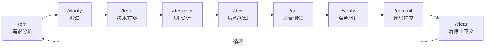

# Claude Code 最佳实践

<p align="center">
  <strong>🚀 安装 → 配置 → 开始编码</strong>
</p>

<p align="center">
  <a href="https://opensource.org/licenses/MIT"></a>
  <a href="https://github.com/xiaobei930/claude-code-best-practices/releases"></a>
  <a href="https://github.com/xiaobei930/claude-code-best-practices/actions/workflows/validate-template.yml"></a>
</p>

<p align="center">
  <a href="https://github.com/xiaobei930/claude-code-best-practices/stargazers"></a>
  <a href="https://github.com/xiaobei930/claude-code-best-practices/network/members"></a>
  <a href="https://github.com/xiaobei930/claude-code-best-practices/commits"></a>
</p>

<p align="center">
  <a href="README.md">English</a> | <strong>中文</strong>
</p>

---

> **安装插件即用，几分钟内开始与 Claude 协作编程。**

Claude Code 插件 & 模板，支持 **Python / Vue / TypeScript / C++ / Java / C# / Go / Swift** 多语言开发。

## 📑 目录

- [为什么使用这个模板？](#为什么使用这个模板)
- [快速开始](#-快速开始)
- [核心特性](#-核心特性)
- [目录结构](#-目录结构)
- [工作流程](#-工作流程)
- [命令速查](#-命令速查)
- [技能说明](#-技能说明)
- [智能体](#-智能体)
- [插件配合](#-插件配合)
- [自定义指南](#-自定义指南)
- [最佳实践](#-最佳实践)
- [常见问题](#-常见问题)
- [环境要求](#-环境要求)
- [参考资源](#-参考资源)

---

## 为什么使用这个模板？

| 没有模板                | 使用模板                     |
| ----------------------- | ---------------------------- |
| ❌ 从零配置 Claude Code | ✅ 开箱即用                  |
| ❌ 代码风格不一致       | ✅ 强制执行编码规范          |
| ❌ 手动重复工作流       | ✅ 角色化自动化（PM→Dev→QA） |
| ❌ 危险命令风险         | ✅ 安全钩子保护系统          |
| ❌ 会话间上下文丢失     | ✅ 记忆库持久化进度          |

### CC-Best vs Superpowers

两者都是优秀的 Claude Code 增强工具，根据需求选择：

| 场景                | 推荐        | 原因                        |
| ------------------- | ----------- | --------------------------- |
| **个人开发者**      | Superpowers | 更轻量，git 工作树自动化    |
| **团队协作**        | CC-Best     | 角色工作流 (PM→Lead→Dev→QA) |
| **多语言技术栈**    | CC-Best     | 7+ 语言编码规范             |
| **中文团队**        | CC-Best     | 双语文档，中文内部文件      |
| **需要 git 工作树** | Superpowers | 自动创建隔离分支            |
| **需要记忆库**      | CC-Best     | progress.md 跨会话持久化    |

> 💡 **可以共存！** 同时安装两个，CC-Best 用于团队工作流，Superpowers 用于 git 自动化。

### 演示

<p align="center">
  
  <br>
  <em>插件命令展示</em>
</p>

---

## 🚀 快速开始

### 方式一：作为插件安装（推荐）

最简单的使用方式 - 直接安装为 Claude Code 插件：

```bash
# 在 Claude Code 中运行：
/plugin

# 选择 "Add Marketplace"，然后输入：
xiaobei930/claude-code-best-practices

# 然后选择 "Install Plugin"，选择：
cc-best
```

或者使用命令行方式：

```bash
# 添加 marketplace
/plugin marketplace add xiaobei930/claude-code-best-practices

# 安装插件
/plugin install cc-best@xiaobei930
```

或者直接添加到 `~/.claude/settings.json`：

```json
{
  "extraKnownMarketplaces": {
    "claude-code-best-practices": {
      "source": {
        "source": "github",
        "repo": "xiaobei930/claude-code-best-practices"
      }
    }
  },
  "enabledPlugins": {
    "cc-best@xiaobei930": true
  }
}
```

安装后即可使用所有命令、智能体、技能和 hooks。

<details>
<summary>📹 查看安装演示</summary>
<br>
<p align="center">
  
</p>
</details>

#### 更新插件

```bash
# 更新到最新版本
/plugin update cc-best@xiaobei930
```

> **注意**：`/plugin marketplace update` 只刷新可用插件列表，**不会更新已安装的插件**。使用 `/plugin update` 获取最新版本。

#### 插件配置

安装为插件后：

1. **覆盖插件设置**，创建本地文件：
   - 在项目中创建 `commands/` 来添加/覆盖命令
   - 创建 `rules/` 来添加项目特定规则

2. **记忆库**：插件不包含 memory-bank，如需要请手动创建：

```bash
mkdir -p memory-bank
touch memory-bank/progress.md
touch memory-bank/architecture.md
```

3. **Hookify 规则**：插件中的 hookify 规则（`.claude/hookify.*.local.md`）不会自动应用到你的项目。核心安全功能由 `hooks/hooks.json` 提供。

---

### 方式二：Clone 模板（完全定制）

适用于需要完全控制的新项目：

```bash
# 1. 克隆模板
git clone https://github.com/xiaobei930/claude-code-best-practices.git my-project
cd my-project

# 2. 运行初始化
bash scripts/shell/init.sh

# 3. 编辑 CLAUDE.md，替换占位符
#    {{PROJECT_NAME}} → 项目名称
#    {{PROJECT_DESCRIPTION}} → 项目描述
#    {{DATE}} → 当前日期

# 4. 开始开发
/pm   # 从产品经理角色开始第一个需求
```

#### 复制到现有项目

```bash
# 复制配置文件到你的项目
cp -r claude-code-best-practices/.claude /path/to/your/project/
cp -r claude-code-best-practices/commands /path/to/your/project/
cp -r claude-code-best-practices/skills /path/to/your/project/
cp -r claude-code-best-practices/agents /path/to/your/project/
cp -r claude-code-best-practices/rules /path/to/your/project/
cp -r claude-code-best-practices/scripts /path/to/your/project/
cp -r claude-code-best-practices/hooks /path/to/your/project/
cp -r claude-code-best-practices/memory-bank /path/to/your/project/
cp claude-code-best-practices/CLAUDE.md /path/to/your/project/

# 进入项目并初始化
cd /path/to/your/project
bash scripts/shell/init.sh
```

> **Windows 用户**：使用 Git Bash 运行脚本，或使用 `robocopy` 复制文件。

---

### 插件 vs Clone：何时使用哪种方式

| 方式           | 适用场景 | 获得内容                           |
| -------------- | -------- | ---------------------------------- |
| **安装插件**   | 现有项目 | 命令、技能、智能体、hooks 即时可用 |
| **Clone 模板** | 新项目   | 完全可定制，所有文件在你的仓库中   |

> **注意**：不要在从此模板 clone 的项目中安装此插件——会导致命令和 hooks 重复。

---

## ✨ 核心特性

### 🎭 角色化工作流

PM → Lead → Designer → Dev → QA → Commit 完整开发循环，每个角色有明确职责。

### 🔄 自主迭代模式

`/iterate` 模式让 Claude 自主完成任务列表，无需频繁干预。

<details>
<summary>📹 查看 /iterate 运行演示</summary>
<br>
<p align="center">
  
</p>
</details>

### 🛡️ 安全钩子

预配置的危险操作防护：阻止 `rm -rf /`、`git push --force` 等危险命令。

### 📐 多语言规范

7+ 种语言的编码规范：Python、Vue/TS、C++、Java、C#、Go 等。

### 🧠 记忆库

`memory-bank/` 目录持久化项目进度、架构决策、技术选型。

**自动归档**: `progress.md` 采用滚动窗口策略防止文件膨胀：

- 只保留最近 5 项完成任务、5 条决策、5 个检查点
- 旧记录自动归档到 `progress-archive.md`
- 文件超过 300 行时执行 `/checkpoint --archive`

### 🌐 跨平台支持

基于 Node.js 的 hooks 和工具库，支持 Windows/macOS/Linux。自动检测包管理器（npm/pnpm/yarn/bun）。

### 🔌 MCP 集成

开箱即用的 MCP 服务器配置，支持 memory、playwright、firecrawl 等。

---

## 📁 目录结构

```
your-project/
├── CLAUDE.md                   # 项目宪法（必须保留）
├── memory-bank/                # 项目记忆库
│   ├── progress.md             # 进度跟踪（滚动窗口）
│   ├── progress-archive.md     # 历史记录归档
│   ├── architecture.md         # 架构文档
│   └── tech-stack.md           # 技术选型
│
├── commands/                   # Slash 命令（35）
│   ├── pm.md, lead.md          # 角色命令
│   ├── iterate.md, pair.md     # 模式命令
│   └── build.md, test.md       # 工具命令
│
├── rules/                      # 编码规范（13 个文件）
│   ├── methodology.md          # 开发方法论
│   ├── coding-standards.md     # 通用标准
│   ├── code-style.md           # Python 风格
│   ├── frontend-style.md       # Vue/TS/JS 风格
│   └── security.md             # 安全规则
│
├── skills/                     # 开发技能（17 类）
│   ├── backend/                # 后端模式（5 种语言）
│   ├── frontend/               # 前端模式（4 种框架）
│   ├── testing/                # 测试（TDD、E2E）
│   └── security/               # 安全审查
│
├── agents/                     # 子智能体（6 个）
│   ├── code-reviewer.md        # 代码审查
│   └── security-reviewer.md    # 安全审查
│
├── scripts/                    # 自动化脚本（按语言分类）
│   ├── shell/                  # Bash 脚本 (10)
│   │   ├── init.sh, cleanup.sh
│   │   └── session-start.sh, session-end.sh
│   ├── python/                 # Python 脚本 (9)
│   │   ├── validate-command.py, protect-files.py
│   │   └── format-file.py, check-console-log.py
│   └── node/                   # Node.js（默认，跨平台）
│       ├── lib/                # 工具库
│       │   ├── utils.js        # 27 个辅助函数
│       │   └── package-manager.js
│       ├── verify-hooks.js     # Hooks 配置验证器
│       ├── archive-progress.js # 进度文件归档器
│       └── hooks/              # 14 个生命周期钩子
│           ├── validate-command.js, protect-files.js
│           ├── session-start.js, session-end.js
│           └── format-file.js, typescript-check.js
│
├── hooks/                      # Hook 配置
│   ├── hooks.json              # 插件 hooks 配置
│   └── README.md               # Hooks 使用文档
│
├── .claude-plugin/             # 插件市场元数据
│   ├── plugin.json             # 插件清单
│   └── marketplace.json        # 市场列表信息
│
└── .claude/                    # Claude Code 配置
    ├── settings.json           # 基础权限（提交到 Git）
    ├── settings.local.json     # 本地配置 + Hooks（不提交）
    ├── tools.md                # 脚本和工具清单
    ├── mcp-configs/            # MCP 服务器配置
    ├── ralph-prompts/          # Ralph Loop 提示词
    └── learned/                # 持续学习存储
```

---

## 🔄 工作流程

### 标准开发循环



### 三种开发模式

| 模式         | 命令          | 适用场景       | 特点               |
| ------------ | ------------- | -------------- | ------------------ |
| **自主迭代** | `/iterate`    | 任务清单明确   | 完全自主，无需干预 |
| **结对编程** | `/pair`       | 学习、敏感操作 | 每步确认，人机协作 |
| **长时循环** | `/ralph-loop` | 小时级批量任务 | 需安装插件         |

---

## 📋 命令速查

**35 个命令**，按类别组织：

| 类别       | 命令                                                              | 用途           |
| ---------- | ----------------------------------------------------------------- | -------------- |
| **角色**   | `/pm`, `/lead`, `/dev`, `/qa`, `/designer`, `/clarify`, `/verify` | 开发工作流角色 |
| **模式**   | `/iterate`, `/pair`, `/cc-ralph`, `/mode`                         | 自主/结对模式  |
| **构建**   | `/build`, `/test`, `/run`, `/fix`                                 | 构建测试自动化 |
| **Git**    | `/commit`, `/pr`, `/git`                                          | 版本控制       |
| **上下文** | `/compact`, `/checkpoint`, `/catchup`, `/context`, `/memory`      | 会话管理       |
| **质量**   | `/cleanup`, `/docs`, `/learn`, `/analyze`, `/evolve`              | 代码质量&知识  |
| **配置**   | `/setup`, `/setup-pm`, `/status`, `/self-check`                   | 配置诊断       |

> 📖 **完整参考**: 查看 [COMMANDS.md](.claude-plugin/COMMANDS.md) 了解所有参数和用法示例。

---

## 🛠️ 技能说明

**17 个开发技能**，按领域组织：

| 领域     | 技能                                 | 覆盖范围                       |
| -------- | ------------------------------------ | ------------------------------ |
| **后端** | `backend`, `api`, `database`         | Python, TS, Java, Go, C#, Rust |
| **前端** | `frontend`                           | Vue, React, Svelte, Angular    |
| **质量** | `testing`, `security`, `debug`       | TDD, OWASP, 性能分析           |
| **架构** | `architecture`, `devops`, `git`      | ADR, CI/CD, 分支策略           |
| **会话** | `learning`, `compact`, `exploration` | 知识管理                       |

> 📖 **完整参考**: 查看 [skills/README](skills/README) 了解技能详细文档。

---

## 🏗️ 架构概览

本模板采用**三层架构**：

| 层级         | 触发方式        | 用途                     |
| ------------ | --------------- | ------------------------ |
| **Commands** | 用户输入 `/xxx` | 角色工作流，用户主动操作 |
| **Skills**   | 自动注入        | 最佳实践，编码规范       |
| **Agents**   | Task 工具委派   | 专业子任务（审查、规划） |

**6 个专业智能体**: `code-reviewer`, `code-simplifier`, `planner`, `requirement-validator`, `security-reviewer`, `tdd-guide`

> 📐 **完整文档**: 查看 [ARCHITECTURE.md](.claude-plugin/ARCHITECTURE.md) 了解组件关系和调用链路。
>
> 🤖 **智能体详情**: 查看 [agents/README](agents/README) 了解智能体能力和调用方式。

---

## 🔌 插件配合

本模板设计为与官方 Claude Code 插件无缝配合。我们内置的智能体和技能是对官方插件的补充（而非替代）。

### 与官方插件的关系

| 模板内容                   | 官方插件            | 关系说明                                       |
| -------------------------- | ------------------- | ---------------------------------------------- |
| `code-reviewer` 智能体     | `code-review` 插件  | 模板：轻量级本地版；插件：功能更强大，自动触发 |
| `security-reviewer` 智能体 | `security-guidance` | 模板：OWASP 检查清单；插件：自动安全分析       |
| `code-simplifier` 智能体   | `code-simplifier`   | 功能相似；插件拥有更多上下文                   |
| `/iterate` 命令            | `ralph-loop` 插件   | 模板：单会话循环；插件：跨会话持久化           |
| `hookify` 示例             | `hookify` 插件      | 模板：示例配置；插件：完整钩子管理             |

### 推荐的插件配置

```json
{
  "enabledPlugins": {
    "code-review@claude-plugins-official": true,
    "hookify@claude-plugins-official": true,
    "security-guidance@claude-plugins-official": true
  }
}
```

### 使用建议

- **未安装插件时**：模板智能体/技能可独立工作
- **已安装插件时**：插件用于高级功能，模板用于快速本地检查
- **最佳实践**：安装插件，使用模板智能体获得即时反馈，使用插件进行深度分析

---

## ⚙️ 自定义指南

### 添加新规则

在 `rules/` 创建文件：

```markdown
---
paths:
  - "**/*.your-ext"
---

# 规则标题

## 规则内容

...
```

### 添加新命令

在 `commands/` 创建文件：

```markdown
---
allowed_tools:
  - Read
  - Edit
  - Write
  - Bash
---

# /your-command - 命令名称

## 职责

...

## 执行步骤

1. ...
2. ...
```

### 配置 Hooks

编辑 `.claude/settings.local.json`：

```json
{
  "hooks": {
    "PreToolUse": [
      {
        "matcher": "Bash",
        "hooks": [
          {
            "type": "command",
            "command": "python scripts/your-script.py",
            "timeout": 5
          }
        ]
      }
    ]
  }
}
```

### 预配置的 Hooks

> ⚠️ **重要：Hooks 需要手动启用**
>
> 由于 [Claude Code 已知问题](https://github.com/anthropics/claude-code/issues/9354)，插件 hooks **默认禁用**。要启用安全防护和自动化 hooks，请运行：
>
> ```bash
> /setup --hooks
> ```
>
> 此命令会配置使用绝对路径的 hooks。详见 [FAQ](#钩子问题)。

> 默认使用 Node.js 版本，支持 Windows/macOS/Linux 跨平台运行。

| 触发时机     | 功能              | 脚本 (Node.js)                       |
| ------------ | ----------------- | ------------------------------------ |
| PreToolUse   | 验证危险命令      | `node/hooks/validate-command.js`     |
| PreToolUse   | Git push 前确认   | `node/hooks/pause-before-push.js`    |
| PreToolUse   | 保护敏感文件      | `node/hooks/protect-files.js`        |
| PreToolUse   | 阻止随机 .md 文件 | `node/hooks/block-random-md.js`      |
| PreToolUse   | 长时间运行警告    | `node/hooks/long-running-warning.js` |
| PostToolUse  | 自动格式化        | `node/hooks/format-file.js`          |
| PostToolUse  | TypeScript 检查   | `node/hooks/typescript-check.js`     |
| PostToolUse  | console.log 检查  | `node/hooks/check-console-log.js`    |
| SessionStart | 会话健康检查      | `node/hooks/session-check.js`        |
| SessionStart | 会话启动初始化    | `node/hooks/session-start.js`        |
| SessionEnd   | 会话结束持久化    | `node/hooks/session-end.js`          |

---

## 💡 最佳实践

### 1. CLAUDE.md 保持简洁

- 控制在 100 行以内
- 详细规范放在 `rules/`

### 2. 善用记忆库

- 每次任务完成后更新 `progress.md`
- 重要决策记录到 `architecture.md`

### 3. 上下文管理

- 普通模式：频繁 `/clear`，避免上下文过长
- `/iterate` 模式：不主动 clear，保持循环连续性

### 4. MCP 不要贪多

- 同时启用不超过 10 个 MCP 服务器
- 用 `disabledMcpServers` 禁用不用的

### 5. 定期清理

- 删除不用的语言规则
- 删除不用的命令

### 6. MCP 临时目录管理

MCP 工具会在项目中自动创建临时目录：

| 目录                   | 来源         | 用途                       |
| ---------------------- | ------------ | -------------------------- |
| `.playwright-mcp/`     | MCP 自动创建 | Playwright MCP 临时文件    |
| `.claude/mcp-data/`    | MCP 自动创建 | MCP 共享数据               |
| `*-mcp/`               | MCP 自动创建 | 其他 MCP 工具目录          |
| `.claude/screenshots/` | 模板预定义   | 手动保存的截图（有意义的） |

**清理脚本**：使用 `cleanup.sh` 进行定期维护：

```bash
# 预览待删除文件（dry run）
bash scripts/shell/cleanup.sh --dry-run

# 清理 7 天前的文件（默认）
bash scripts/shell/cleanup.sh

# 清理 3 天前的文件
bash scripts/shell/cleanup.sh --days 3

# 清理所有 MCP 临时文件
bash scripts/shell/cleanup.sh --all
```

---

## ❓ 常见问题

> 📖 **完整 FAQ**：查看 [FAQ.md](FAQ.md) 获取详细故障排查指南。

### 快速解答

<details>
<summary><strong>钩子不工作？</strong></summary>

运行 `/setup --verify` 诊断。常见修复：

- Clone 用户：`cp .claude/settings.local.json.example .claude/settings.local.json`
- 插件用户：运行 `/setup --hooks` 配置绝对路径
- Windows：查看 [FAQ.md](FAQ.md#钩子问题) 了解 `${CLAUDE_PLUGIN_ROOT}` 解决方案
</details>

<details>
<summary><strong>/iterate vs /pair？</strong></summary>

| 模式       | 控制方式 | 适用场景       |
| ---------- | -------- | -------------- |
| `/iterate` | 完全自主 | 任务清单明确   |
| `/pair`    | 每步确认 | 学习、敏感操作 |

</details>

<details>
<summary><strong>MCP 配置？</strong></summary>

编辑 `.claude/settings.local.json`：

```json
{ "enabledMcpjsonServers": ["memory", "sequential-thinking"] }
```

最佳实践：每个项目启用 ≤10 个 MCP 服务器。

</details>

---

## 🔧 环境要求

| 依赖          | 版本       | 说明                     |
| ------------- | ---------- | ------------------------ |
| Claude Code   | 推荐最新版 | 钩子功能需要较新版本     |
| Node.js       | 16+        | 用于跨平台 hooks（默认） |
| Python        | 3.8+       | 用于部分钩子脚本         |
| Bash/Git Bash | 任意版本   | 可选，用于 bash 版 hooks |

### 可选 MCP 服务器

部分命令使用 MCP（Model Context Protocol）工具提供增强功能：

| MCP 服务器 | 使用者                     | 用途                             |
| ---------- | -------------------------- | -------------------------------- |
| Playwright | `/designer`, `/dev`, `/pm` | 浏览器自动化，用于 UI 测试和截图 |
| Firecrawl  | `/pm`, `/lead`             | 网页抓取，用于需求调研           |

> **说明**：这些是可选的。没有 MCP 服务器命令也能工作，但功能会有所减少。
> 安装方式：Claude Code 设置 > MCP Servers

### 支持的语言

| 语言      | 规则文件            | 格式化工具         | 测试框架    |
| --------- | ------------------- | ------------------ | ----------- |
| Python    | `code-style.md`     | Black + isort      | pytest      |
| Vue/TS/JS | `frontend-style.md` | Prettier           | Vitest      |
| C++       | `cpp-style.md`      | clang-format       | Google Test |
| Java      | `java-style.md`     | google-java-format | JUnit       |
| C#        | `csharp-style.md`   | dotnet format      | xUnit/NUnit |
| Go        | `backend/go.md`     | gofmt              | testing     |

---

## 📚 参考资源

### 官方资源

- [Anthropic 官方最佳实践](https://www.anthropic.com/engineering/claude-code-best-practices)
- [CLAUDE.md 完整指南](https://www.builder.io/blog/claude-md-guide)

### 社区项目

- [everything-claude-code](https://github.com/affaan-m/everything-claude-code) - Claude Code 资源集合
- [vibe-coding-cn](https://github.com/2025Emma/vibe-coding-cn) - 中文 Vibe Coding 指南

---

## 🤝 参与贡献

欢迎贡献！查看 [CONTRIBUTING.md](CONTRIBUTING.md) 了解详情。

| 贡献方式           | 说明                                                     |
| ------------------ | -------------------------------------------------------- |
| ⭐ Star            | 表示支持                                                 |
| 🐛 Bug Report      | [报告问题](../../issues/new?template=bug_report.md)      |
| 💡 Feature Request | [建议功能](../../issues/new?template=feature_request.md) |
| 📝 Documentation   | 改进文档                                                 |
| 🔧 Code            | 添加命令、规则、技能                                     |

---

## 📄 许可证

[MIT License](LICENSE) - 可自由使用和修改

---

<p align="center">
  <strong>如果这个模板对你有帮助，请给它一个 ⭐ Star！</strong>
</p>
