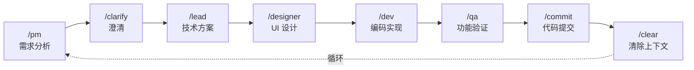

# Claude Code 最佳实践模板

<p align="center">
  <strong>🚀 Clone → 配置 → 开始编码</strong>
</p>

<p align="center">
  <a href="https://opensource.org/licenses/MIT"></a>
  <a href="https://github.com/xiaobei930/claude-code-best-practices/actions/workflows/validate-template.yml"></a>
  <a href="https://github.com/xiaobei930/claude-code-best-practices/stargazers"></a>
</p>

<p align="center">
  <a href="README.md">English</a> | <strong>中文</strong>
</p>

---

> **Clone 即用，几分钟内开始与 Claude 协作编程。**

这是一个可复制到任意项目的 Claude Code 配置模板，支持 **Python / Vue / TypeScript / C++ / Java / C# / Go** 多语言开发。

## 📑 目录

- [为什么使用这个模板？](#为什么使用这个模板)
- [快速开始](#-快速开始)
- [核心特性](#-核心特性)
- [目录结构](#-目录结构)
- [工作流程](#-工作流程)
- [命令速查](#-命令速查)
- [技能说明](#-技能说明)
- [智能体](#-智能体)
- [插件配合](#-插件配合)
- [自定义指南](#-自定义指南)
- [最佳实践](#-最佳实践)
- [常见问题](#-常见问题)
- [环境要求](#-环境要求)
- [参考资源](#-参考资源)

---

## 为什么使用这个模板？

| 没有模板 | 使用模板 |
|----------|----------|
| ❌ 从零配置 Claude Code | ✅ 开箱即用 |
| ❌ 代码风格不一致 | ✅ 强制执行编码规范 |
| ❌ 手动重复工作流 | ✅ 角色化自动化（PM→Dev→QA） |
| ❌ 危险命令风险 | ✅ 安全钩子保护系统 |
| ❌ 会话间上下文丢失 | ✅ 记忆库持久化进度 |

---

## 🚀 快速开始

### 5 分钟上手

```bash
# 1. 克隆模板
git clone https://github.com/xiaobei930/claude-code-best-practices.git my-project
cd my-project

# 2. 运行初始化
bash .claude/scripts/init.sh

# 3. 编辑 CLAUDE.md，替换占位符
#    {{PROJECT_NAME}} → 项目名称
#    {{PROJECT_DESCRIPTION}} → 项目描述
#    {{DATE}} → 当前日期

# 4. 开始开发
/pm   # 从产品经理角色开始第一个需求
```

### 复制到现有项目

```bash
# 复制配置文件到你的项目
cp -r claude-code-best-practices/.claude /path/to/your/project/
cp claude-code-best-practices/CLAUDE.md /path/to/your/project/
cp -r claude-code-best-practices/memory-bank /path/to/your/project/

# 进入项目并初始化
cd /path/to/your/project
bash .claude/scripts/init.sh
```

> **Windows 用户**：使用 Git Bash 运行脚本，或使用 `robocopy` 复制文件。

---

## ✨ 核心特性

### 🎭 角色化工作流
PM → Lead → Dev → QA → Commit 完整开发循环，每个角色有明确职责。

### 🔄 自主迭代模式
`/iterate` 模式让 Claude 自主完成任务列表，无需频繁干预。

### 🛡️ 安全钩子
预配置的危险操作防护：阻止 `rm -rf /`、`git push --force` 等危险命令。

### 📐 多语言规范
7+ 种语言的编码规范：Python、Vue/TS、C++、Java、C#、Go 等。

### 🧠 记忆库
`memory-bank/` 目录持久化项目进度、架构决策、技术选型。

### 🔌 MCP 集成
开箱即用的 MCP 服务器配置，支持 memory、playwright、firecrawl 等。

---

## 📁 目录结构

```
your-project/
├── CLAUDE.md                   # 项目宪法（必须保留）
├── memory-bank/                # 项目记忆库
│   ├── progress.md             # 进度跟踪
│   ├── architecture.md         # 架构文档
│   └── tech-stack.md           # 技术选型
│
└── .claude/
    ├── settings.json           # 基础权限（提交到 Git）
    ├── settings.local.json     # 本地配置 + Hooks（不提交）
    │
    ├── commands/               # Slash 命令（30+）
    │   ├── pm.md, lead.md      # 角色命令
    │   ├── iterate.md, pair.md # 模式命令
    │   └── build.md, test.md   # 工具命令
    │
    ├── rules/                  # 编码规范（13 个文件）
    │   ├── methodology.md      # 开发方法论
    │   ├── coding-standards.md # 通用标准
    │   ├── code-style.md       # Python 风格
    │   ├── frontend-style.md   # Vue/TS/JS 风格
    │   └── security.md         # 安全规则
    │
    ├── skills/                 # 开发技能（12 类）
    │   ├── backend-patterns/   # 后端模式
    │   ├── frontend-patterns/  # 前端模式
    │   ├── devops-patterns/    # DevOps 模式
    │   └── tdd-workflow/       # TDD 工作流
    │
    ├── agents/                 # 子智能体（6 个）
    │   ├── code-reviewer.md    # 代码审查
    │   └── security-reviewer.md# 安全审查
    │
    └── scripts/                # 自动化脚本（17 个）
        ├── init.sh             # 初始化
        ├── cleanup.sh          # MCP 临时目录清理
        ├── format_file.py      # 自动格式化
        └── validate_command.py # 命令验证
```

---

## 🔄 工作流程

### 标准开发循环



### 三种开发模式

| 模式 | 命令 | 适用场景 | 特点 |
|------|------|----------|------|
| **自主迭代** | `/iterate` | 任务清单明确 | 完全自主，无需干预 |
| **结对编程** | `/pair` | 学习、敏感操作 | 每步确认，人机协作 |
| **长时循环** | `/ralph-loop` | 小时级批量任务 | 需安装插件 |

---

## 📋 命令速查

### 角色命令

| 命令 | 角色 | 职责 |
|------|------|------|
| `/pm` | 产品经理 | 需求分析、用户故事、验收标准 |
| `/lead` | 技术负责人 | 技术方案、任务分解、架构决策 |
| `/dev` | 开发工程师 | 代码实现、单元测试 |
| `/qa` | 质量工程师 | 功能验证、测试用例 |
| `/designer` | UI 设计师 | 设计指导、界面规范 |
| `/clarify` | 澄清专家 | 需求澄清、边界确认 |

### 模式命令

| 命令 | 说明 |
|------|------|
| `/iterate` | 自主迭代循环，读取 progress.md 自动执行任务 |
| `/pair` | 结对编程模式，每个关键步骤确认后继续 |

### 工具命令

| 命令 | 功能 |
|------|------|
| `/build` | 构建项目 |
| `/test` | 运行测试 |
| `/run` | 启动开发服务器 |
| `/commit` | Git 提交 |
| `/pr` | 创建 Pull Request |
| `/git` | Git 提交规范 |
| `/status` | 查看项目状态 |
| `/checkpoint` | 创建检查点 |
| `/compact` | 压缩上下文 |
| `/context` | 上下文管理 |
| `/memory` | 项目记忆管理 |
| `/verify` | 验证代码质量 |
| `/setup` | 项目初始化 |
| `/fix` | 修复构建错误 |
| `/docs` | 同步文档 |

### 辅助命令

| 命令 | 功能 |
|------|------|
| `/catchup` | 快速恢复上下文 |
| `/cleanup` | 死代码清理 |
| `/learn` | 会话学习 |
| `/self-check` | 自我检查验证 |
| `/task` | 任务粒度管理 |
| `/infer` | 模型推理 |
| `/train` | 模型训练 |

---

## 🛠️ 技能说明

| 技能 | 用途 | 主要内容 |
|------|------|----------|
| `backend-patterns` | 后端开发 | 通用模式 + Python/TS/Java/Go/C# 子文件 |
| `frontend-patterns` | 前端开发 | 通用模式 + Vue/React/Svelte/Angular 子文件 |
| `devops-patterns` | DevOps 实践 | CI/CD 流水线、Docker、部署策略 |
| `tdd-workflow` | 测试驱动开发 | Red-Green-Refactor 循环 |
| `api-development` | API 开发 | RESTful 设计、响应格式、认证 |
| `database-patterns` | 数据库设计 | 命名规范、查询优化、迁移管理 |
| `security-review` | 安全审查 | OWASP 检查清单、漏洞防护 |
| `debugging` | 系统化调试 | 问题定位、日志分析、性能剖析 |
| `git-workflow` | Git 工作流 | 分支策略、提交规范、冲突解决 |
| `isolated-research` | 深度代码研究 | 隔离上下文探索，不污染主会话 |
| `continuous-learning` | 持续学习 | 会话评估、知识提取 |
| `strategic-compact` | 策略性压缩 | 压缩时机、最佳实践 |

---

## 🤖 智能体

用于专门任务的子智能体，由 Task 工具自动调用。

| 智能体 | 用途 | 触发场景 |
|--------|------|----------|
| `code-reviewer` | 代码审查 | 代码修改后进行质量/架构检查 |
| `code-simplifier` | 代码简化 | 功能完成后清理、消除冗余 |
| `planner` | 任务规划 | 复杂功能实现、架构变更 |
| `requirement-validator` | 需求验证 | 设计阶段前验证需求文档 |
| `security-reviewer` | 安全审查 | 认证、用户输入、密钥、API 端点 |
| `tdd-guide` | TDD 指导 | 新功能、Bug 修复、测试优先方法 |

---

## 🔌 插件配合

本模板设计为与官方 Claude Code 插件无缝配合。我们内置的智能体和技能是对官方插件的补充（而非替代）。

### 与官方插件的关系

| 模板内容 | 官方插件 | 关系说明 |
|----------|----------|----------|
| `code-reviewer` 智能体 | `code-review` 插件 | 模板：轻量级本地版；插件：功能更强大，自动触发 |
| `security-reviewer` 智能体 | `security-guidance` | 模板：OWASP 检查清单；插件：自动安全分析 |
| `code-simplifier` 智能体 | `code-simplifier` | 功能相似；插件拥有更多上下文 |
| `/iterate` 命令 | `ralph-loop` 插件 | 模板：单会话循环；插件：跨会话持久化 |
| `hookify` 示例 | `hookify` 插件 | 模板：示例配置；插件：完整钩子管理 |

### 推荐的插件配置

```json
{
  "enabledPlugins": {
    "code-review@claude-plugins-official": true,
    "hookify@claude-plugins-official": true,
    "security-guidance@claude-plugins-official": true
  }
}
```

### 使用建议

- **未安装插件时**：模板智能体/技能可独立工作
- **已安装插件时**：插件用于高级功能，模板用于快速本地检查
- **最佳实践**：安装插件，使用模板智能体获得即时反馈，使用插件进行深度分析

---

## ⚙️ 自定义指南

### 添加新规则

在 `.claude/rules/` 创建文件：

```markdown
---
paths:
  - "**/*.your-ext"
---

# 规则标题

## 规则内容
...
```

### 添加新命令

在 `.claude/commands/` 创建文件：

```markdown
---
allowed_tools:
  - Read
  - Edit
  - Write
  - Bash
---

# /your-command - 命令名称

## 职责
...

## 执行步骤
1. ...
2. ...
```

### 配置 Hooks

编辑 `.claude/settings.local.json`：

```json
{
  "hooks": {
    "PreToolUse": [
      {
        "matcher": "Bash",
        "hooks": [
          {
            "type": "command",
            "command": "python .claude/scripts/your-script.py",
            "timeout": 5000
          }
        ]
      }
    ]
  }
}
```

### 预配置的 Hooks

| 触发时机 | 功能 | 脚本 |
|----------|------|------|
| PreToolUse | 验证危险命令 | `validate_command.py` |
| PreToolUse | Git push 前确认 | `pause_before_push.sh` |
| PreToolUse | 保护敏感文件 | `protect_files.py` |
| PostToolUse | 自动格式化 | `format_file.py` |
| PostToolUse | TypeScript 检查 | `typescript_check.sh` |
| SessionStart | 会话健康检查 | `session_check.py` |
| Stop | 会话结束持久化 | `session_end.sh` |

---

## 💡 最佳实践

### 1. CLAUDE.md 保持简洁
- 控制在 100 行以内
- 详细规范放在 `.claude/rules/`

### 2. 善用记忆库
- 每次任务完成后更新 `progress.md`
- 重要决策记录到 `architecture.md`

### 3. 上下文管理
- 普通模式：频繁 `/clear`，避免上下文过长
- `/iterate` 模式：不主动 clear，保持循环连续性

### 4. MCP 不要贪多
- 同时启用不超过 10 个 MCP 服务器
- 用 `disabledMcpServers` 禁用不用的

### 5. 定期清理
- 删除不用的语言规则
- 删除不用的命令

### 6. MCP 临时目录管理

MCP 工具会在项目中自动创建临时目录：

| 目录 | 来源 | 用途 |
|------|------|------|
| `.playwright-mcp/` | MCP 自动创建 | Playwright MCP 临时文件 |
| `.claude/mcp-data/` | MCP 自动创建 | MCP 共享数据 |
| `*-mcp/` | MCP 自动创建 | 其他 MCP 工具目录 |
| `.claude/screenshots/` | 模板预定义 | 手动保存的截图（有意义的） |

**清理脚本**：使用 `cleanup.sh` 进行定期维护：

```bash
# 预览待删除文件（dry run）
bash .claude/scripts/cleanup.sh --dry-run

# 清理 7 天前的文件（默认）
bash .claude/scripts/cleanup.sh

# 清理 3 天前的文件
bash .claude/scripts/cleanup.sh --days 3

# 清理所有 MCP 临时文件
bash .claude/scripts/cleanup.sh --all
```

---

## ❓ 常见问题

### 快速开始

<details>
<summary><strong>Q: 可以删除不需要的文件吗？</strong></summary>

可以！常见可删除文件：
- `.github/` - 如果不需要贡献模板
- `CONTRIBUTING.md`, `CHANGELOG.md`, `FAQ.md` - 模板专用文档
- 不使用的语言规则（如 Python 项目删除 `cpp-style.md`）

最少保留：
- `CLAUDE.md` - 核心配置
- `.claude/settings.json` - 权限设置
- 你使用的语言规则
</details>

<details>
<summary><strong>Q: 需要保留 Git 历史吗？</strong></summary>

不需要。全新开始：
```bash
rm -rf .git
git init
git add .
git commit -m "Initial commit from Claude Code template"
```
</details>

### 钩子问题

<details>
<summary><strong>Q: 钩子不工作怎么办？</strong></summary>

1. 检查 `settings.local.json` 是否存在：
   ```bash
   ls .claude/settings.local.json
   ```
   如果不存在：
   ```bash
   cp .claude/settings.local.json.example .claude/settings.local.json
   ```

2. 检查脚本权限（Linux/Mac）：
   ```bash
   chmod +x .claude/scripts/*.sh
   chmod +x .claude/scripts/*.py
   ```

3. 检查 Claude Code 版本 - 钩子需要较新版本
</details>

<details>
<summary><strong>Q: format_file.py 报编码错误</strong></summary>

Windows 常见问题。解决方案：
1. 确保安装 Python 3.8+
2. 设置环境变量：`PYTHONUTF8=1`
</details>

### 命令问题

<details>
<summary><strong>Q: /iterate 和 /pair 有什么区别？</strong></summary>

| 模式 | 控制方式 | 适用场景 |
|------|---------|----------|
| `/iterate` | 完全自主 | 任务清单明确 |
| `/pair` | 每步确认 | 学习、敏感操作 |
</details>

<details>
<summary><strong>Q: /iterate 意外停止了</strong></summary>

检查停止条件：
- 用户中断（Ctrl+C）
- `progress.md` 任务全部完成
- 发生致命错误
- 需要用户决策

恢复：再次运行 `/iterate`
</details>

<details>
<summary><strong>Q: 命令找不到</strong></summary>

- 确认文件在 `.claude/commands/` 目录
- 确认扩展名是 `.md`
- 重启 Claude Code
</details>

### MCP 问题

<details>
<summary><strong>Q: 如何配置 MCP 服务器？</strong></summary>

编辑 `.claude/settings.local.json`：
```json
{
  "enabledMcpjsonServers": [
    "memory",
    "sequential-thinking"
  ]
}
```
然后重启 Claude Code。
</details>

<details>
<summary><strong>Q: MCP 工具太多导致问题</strong></summary>

最佳实践：每个项目启用不超过 10 个。
```json
{
  "disabledMcpServers": ["github", "vercel"]
}
```
</details>

### 故障排查

<details>
<summary><strong>Q: "Permission denied" 错误</strong></summary>

```bash
# Linux/Mac
chmod +x .claude/scripts/*.sh
chmod +x .claude/scripts/*.py

# Windows：以管理员身份运行
```
</details>

<details>
<summary><strong>Q: 修改规则后不生效</strong></summary>

- Claude Code 在会话开始时缓存规则
- 修改后重启会话或使用 `/clear`
</details>

---

## 🔧 环境要求

| 依赖 | 版本 | 说明 |
|------|------|------|
| Claude Code | 推荐最新版 | 钩子功能需要较新版本 |
| Python | 3.8+ | 用于钩子脚本 |
| Bash/Git Bash | 任意版本 | Windows 使用 Git Bash |

### 支持的语言

| 语言 | 规则文件 | 格式化工具 | 测试框架 |
|------|----------|------------|----------|
| Python | `code-style.md` | Black + isort | pytest |
| Vue/TS/JS | `frontend-style.md` | Prettier | Vitest |
| C++ | `cpp-style.md` | clang-format | Google Test |
| Java | `java-style.md` | google-java-format | JUnit |
| C# | `csharp-style.md` | dotnet format | xUnit/NUnit |
| Go | `backend-patterns/go.md` | gofmt | testing |

---

## 📚 参考资源

### 官方资源
- [Anthropic 官方最佳实践](https://www.anthropic.com/engineering/claude-code-best-practices)
- [CLAUDE.md 完整指南](https://www.builder.io/blog/claude-md-guide)

### 社区项目
- [everything-claude-code](https://github.com/affaan-m/everything-claude-code) - Claude Code 资源集合
- [vibe-coding-cn](https://github.com/2025Emma/vibe-coding-cn) - 中文 Vibe Coding 指南

---

## 🤝 参与贡献

欢迎贡献！查看 [CONTRIBUTING.md](CONTRIBUTING.md) 了解详情。

| 贡献方式 | 说明 |
|----------|------|
| ⭐ Star | 表示支持 |
| 🐛 Bug Report | [报告问题](../../issues/new?template=bug_report.md) |
| 💡 Feature Request | [建议功能](../../issues/new?template=feature_request.md) |
| 📝 Documentation | 改进文档 |
| 🔧 Code | 添加命令、规则、技能 |

---

## 📄 许可证

[MIT License](LICENSE) - 可自由使用和修改

---

<p align="center">
  <strong>如果这个模板对你有帮助，请给它一个 ⭐ Star！</strong>
</p>
