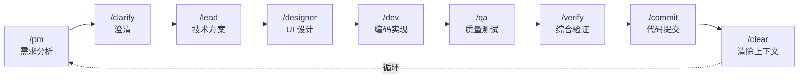
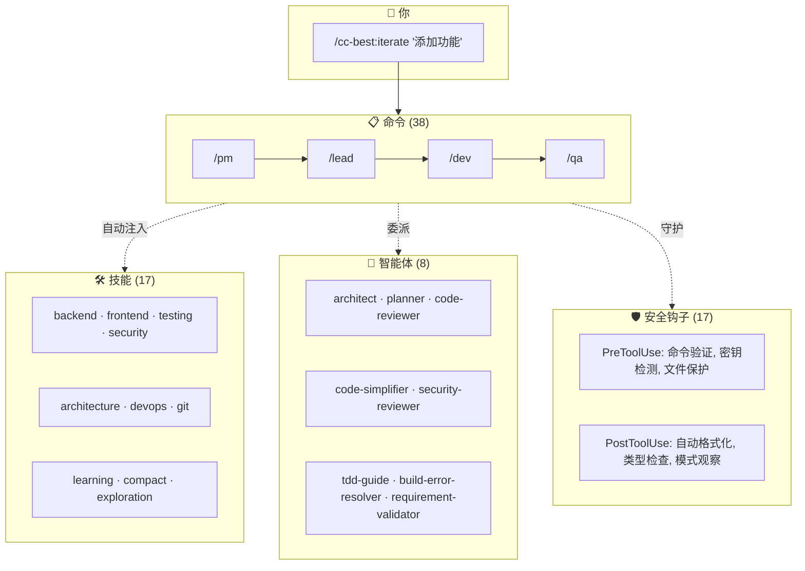

# CC-Best

<p align="center">
  <strong>角色驱动的 Claude Code 开发工作流</strong>
</p>

<p align="center">
  <a href="https://opensource.org/licenses/MIT"></a>
  <a href="https://github.com/xiaobei930/cc-best/releases"></a>
  <a href="https://github.com/xiaobei930/cc-best/actions/workflows/validate-plugin.yml"></a>
  <a href="https://github.com/xiaobei930/cc-best/stargazers"></a>
</p>

<p align="center">
  <a href="README.md">English</a> | <strong>中文</strong>
</p>

---

> **把 Claude 变成完整的开发团队。**
> 从产品需求到代码审查 — 一个插件，完整工作流。

<p align="center">
  <code>38 命令</code> · <code>17 技能</code> · <code>8 智能体</code> · <code>33 规则</code> · <code>18 hooks</code>
</p>

<p align="center">
  
</p>

<p align="center">
  <a href="#-快速开始">快速开始</a> •
  <a href="#-核心特性">核心特性</a> •
  <a href="#-工作流程">工作流程</a> •
  <a href="#-命令速查">命令速查</a> •
  <a href="#-常见问题">常见问题</a>
</p>

### 为什么选择 CC-Best？

🎯 **问题**：Claude Code 很强大，但从零配置工作流、编码规范和安全规则需要数小时。

✨ **方案**：预配置的角色（PM → Lead → Designer → Dev → QA）模拟真实团队协作，内置安全保护。

## ⚡ 快速开始

```bash
# 添加 marketplace 并安装
/plugin marketplace add xiaobei930/cc-best
/plugin install cc-best@xiaobei930

# 验证安装（30 秒）
/cc-best:status

# 开始使用
/cc-best:iterate "实现用户认证功能"
```

> 💡 **启用 Hooks**：安装后运行 `/cc-best:setup --hooks` 开启安全防护和自动化功能。
> 详见 [Hooks 配置](#预配置的-hooks)。

### 插件 vs Clone：命令格式

| 安装方式    | 命令格式           | 示例                          |
| ----------- | ------------------ | ----------------------------- |
| **插件** ⭐ | `/cc-best:command` | `/cc-best:iterate "添加功能"` |
| **Clone**   | `/command`         | `/iterate "添加功能"`         |

> 💡 **推荐**：通过插件安装，自动更新且易于管理。
> 所有文档使用插件格式（`/cc-best:xxx`）。Clone 用户请运行 `convert-to-local.js`。

<p align="center">
  
</p>

<details>
<summary>📦 替代方案：克隆完整仓库</summary>

```bash
git clone https://github.com/xiaobei930/cc-best.git .claude
cd .claude && bash scripts/shell/init.sh

# 将命令格式从 /cc-best:xxx 转换为 /xxx
node scripts/node/convert-to-local.js
```

当你需要完全自定义所有文件时使用克隆方式。

> ⚠️ **重要**：所有文档使用插件格式（`/cc-best:xxx`）。
> 运行转换脚本以更新为本地格式（`/xxx`）。

</details>

<details>
<summary>🗑️ 卸载</summary>

```bash
# 卸载插件
/plugin uninstall cc-best@xiaobei930

# 卸载 Marketplace（可选）
/plugin marketplace remove xiaobei930/cc-best
```

不会留下任何残留文件。

</details>

### 接下来会发生什么？

运行 `/cc-best:iterate "实现用户认证功能"` 后，Claude 会：

```
1. 📋 /cc-best:pm     → 分析需求，创建任务分解
2. 🏗️ /cc-best:lead   → 设计技术方案
3. 💻 /cc-best:dev    → 编写代码，创建测试
4. 🧪 /cc-best:qa     → 运行测试，验证质量
5. ✅ /cc-best:commit → 提交代码，生成规范的提交信息
```

你只需要看着，必要时介入即可。

### 常用工作流

| 我想要...  | 命令                                  | Claude 会做什么                     |
| ---------- | ------------------------------------- | ----------------------------------- |
| 开发新功能 | `/cc-best:iterate "添加暗黑模式切换"` | 完整流程：规划 → 编码 → 测试 → 提交 |
| 修复 Bug   | `/cc-best:iterate "修复登录超时问题"` | 排查 → 修复 → 验证 → 提交           |
| 代码审查   | `/cc-best:pm "审查最近的改动"`        | 分析代码，提出改进建议              |
| 学习代码库 | `/cc-best:pair`                       | 逐步探索，每步都有解释              |

### 适合谁？

| 你是...              | 推荐模式           | 原因                                           |
| -------------------- | ------------------ | ---------------------------------------------- |
| **多角色团队**       | 完整工作流         | PM → Lead → Dev → QA 映射你的流程              |
| **独立开发者**       | `/cc-best:iterate` | 让 Claude 处理繁琐工作                         |
| **学习 Claude Code** | `/cc-best:pair`    | 每一步都理解后再继续                           |
| **快速修复**         | 直接命令           | `/cc-best:dev "修复这个拼写错误"` 处理简单任务 |

---

## ✨ 核心特性

| 特性                | 说明                                                      |
| ------------------- | --------------------------------------------------------- |
| 🎭 **角色化工作流** | PM → Lead → Designer → Dev → QA — 完整开发循环            |
| 🔄 **自主迭代模式** | `/cc-best:iterate` 自动完成任务，无需干预                 |
| 🛡️ **安全钩子**     | 阻止 `rm -rf /`、`git push --force` 等危险命令            |
| 📐 **多语言规范**   | 8 目录分层：通用 + Python/前端/Java/C#/C++/嵌入式/UI 规范 |
| 🧠 **记忆库**       | 跨会话持久化进度和决策                                    |
| 👥 **结对编程**     | `/cc-best:pair` — 5 个确认节点的逐步协作                  |
| 🔗 **知识进化管线** | observe → analyze → learn → evolve 自我进化闭环           |
| 🌐 **跨平台**       | Windows、macOS、Linux — 自动检测包管理器                  |

> CC-Best 专为 Claude Code 构建，但其方法论（道法术器）和角色驱动模式与框架无关，可适配其他 AI 编码助手。

### CC-Best 的独特之处

<details>
<summary><strong>🎭 角色驱动开发管线</strong></summary>

不是简单的 prompt 模板集合 — CC-Best 模拟真实团队协作：

- **7 个角色**，职责边界清晰：PM → Lead → Designer → Dev → QA → Verify → Commit
- 每个角色有明确的 **MUST/SHOULD/NEVER** 规则、输出物模板和交接协议
- **自动流转**：PM 创建 REQ → Lead 评审并创建 DES/TSK → Dev 实现 → QA 验收
- **下游纠偏（A3）**：Lead 可调整 PM 决策；QA 可区分实现 Bug 和需求假设错误
- **文档追溯链**：REQ-XXX → DES-XXX → TSK-XXX 编号关联

</details>

<details>
<summary><strong>🔄 自主迭代引擎</strong></summary>

`/cc-best:iterate` 实现完全自主开发：

```
读取 progress.md → 选择角色 → 执行 → 验证 → 提交 → 下一个任务（不等待）
```

- **智能角色选择**：8 种状态条件决定激活哪个角色
- **A1-A5 决策原则**：上下文推断（A1）、决策记录（A2）、下游纠偏（A3）、MVP 兜底（A4）、问题分类（A5）
- **4 种严格停止条件**：任务全部完成、用户中断、致命错误、外部依赖
- **跨会话连续性**：memory-bank + progress.md 滚动窗口

</details>

<details>
<summary><strong>🔗 知识自进化管线</strong></summary>

CC-Best 从你的开发模式中学习：

```
observe → analyze → learn → evolve
```

- **observe**：`observe-patterns.js` 钩子自动追踪工具使用模式
- **analyze**：`/cc-best:analyze` 挖掘 git 历史和使用数据
- **learn**：`/cc-best:learn` 提取可复用知识
- **evolve**：`/cc-best:evolve` 从学到的模式生成新的命令、技能或智能体

</details>

---

## 📁 目录结构

```
your-project/
├── CLAUDE.md          # 项目宪法
├── commands/          # 38 个命令
├── skills/            # 17 个技能
├── agents/            # 8 个智能体
├── rules/             # 33 条编码规范 (8 目录分层)
├── hooks/             # 安全钩子
├── scripts/           # 自动化脚本 (node/python/shell)
├── memory-bank/       # 进度 & 架构文档
└── .claude/           # Claude Code 配置
```

<details>
<summary>📂 详细结构</summary>

| 目录           | 内容                                                                                                                                          |
| -------------- | --------------------------------------------------------------------------------------------------------------------------------------------- |
| `commands/`    | 角色命令 (`pm`, `lead`, `dev`, `qa`)，模式命令 (`iterate`, `pair`)，工具命令 (`build`, `test`, `commit`)                                      |
| `skills/`      | 后端、前端、测试、安全、DevOps、架构、Git                                                                                                     |
| `agents/`      | `architect`, `build-error-resolver`, `code-reviewer`, `code-simplifier`, `planner`, `requirement-validator`, `security-reviewer`, `tdd-guide` |
| `rules/`       | 33 条规则，8 目录: `common/` + `python/`, `frontend/`, `java/`, `csharp/`, `cpp/`, `embedded/`, `ui/`                                         |
| `scripts/`     | Node.js 跨平台钩子（默认），Python/Bash 备选                                                                                                  |
| `memory-bank/` | `progress.md`（滚动窗口），`architecture.md`，`tech-stack.md`                                                                                 |

</details>

---

## 🔄 工作流程

### 标准开发循环



### 三种开发模式

| 模式         | 命令                | 适用场景       | 特点                                                                                                                                     |
| ------------ | ------------------- | -------------- | ---------------------------------------------------------------------------------------------------------------------------------------- |
| **自主迭代** | `/cc-best:iterate`  | 任务清单明确   | 完全自主，无需干预                                                                                                                       |
| **结对编程** | `/cc-best:pair`     | 学习、敏感操作 | 每步确认，人机协作                                                                                                                       |
| **长时循环** | `/cc-best:cc-ralph` | 小时级批量任务 | 需安装 [`ralph-loop`](.claude-plugin/MODES.md#cc-bestcc-ralph---长时间循环) 插件（`/plugin install ralph-loop@claude-plugins-official`） |

<details>
<summary><strong>/cc-best:iterate 如何自动选择角色</strong></summary>

| 当前状态           | 选择角色            | 执行动作                         |
| ------------------ | ------------------- | -------------------------------- |
| 无需求文档         | `/cc-best:pm`       | 需求分析                         |
| REQ 有低置信度项   | `/cc-best:clarify`  | 需求澄清                         |
| 有 REQ，无设计     | `/cc-best:lead`     | 技术方案设计                     |
| 有设计，含前端任务 | `/cc-best:designer` | UI 设计指导                      |
| 有待实现任务       | `/cc-best:dev`      | 编码实现                         |
| 代码待验证         | `/cc-best:verify`   | 构建 + 类型 + lint + 测试 + 安全 |
| 验证通过           | `/cc-best:qa`       | 功能验收                         |

**核心行为**：任务完成 → 更新 progress.md → 读取下一个任务 → **立即执行**（不等待）。

**停止条件**：任务全部完成 | 用户中断（Ctrl+C）| 致命错误 | 需要外部依赖。

</details>

<details>
<summary><strong>/cc-best:pair 结对协作机制</strong></summary>

5 个必须确认的节点：

| 确认节点   | 示例                          |
| ---------- | ----------------------------- |
| 需求理解   | "我理解你需要 X，对吗？"      |
| 方案选择   | "方案 A/B？我建议 A，因为..." |
| 破坏性操作 | "即将删除 X，确认吗？"        |
| 外部调用   | "即将调用生产 API，确认吗？"  |
| 提交代码   | "提交信息：'...'，确认吗？"   |

**学习模式**：`/cc-best:pair --learn "教我写单元测试"` — Claude 详细解释每一步。

**安全自主**：即使在结对模式下，Claude 也可以自由读取文件、搜索代码、运行测试和格式化代码。

</details>

> 📖 **详细使用指南**: 参见 [MODES.md](.claude-plugin/MODES.md)，包含各模式的使用场景、控制方法和最佳实践。

---

## 📋 命令速查

**38 个命令**，按类别组织：

| 类别       | 命令                                                                                                                      | 用途                      |
| ---------- | ------------------------------------------------------------------------------------------------------------------------- | ------------------------- |
| **角色**   | `/cc-best:pm`, `/cc-best:lead`, `/cc-best:dev`, `/cc-best:qa`, `/cc-best:designer`, `/cc-best:clarify`, `/cc-best:verify` | 开发工作流角色            |
| **模式**   | `/cc-best:iterate`, `/cc-best:pair`, `/cc-best:cc-ralph`, `/cc-best:mode`                                                 | 自主/结对模式             |
| **构建**   | `/cc-best:build`, `/cc-best:test`, `/cc-best:run`, `/cc-best:fix`                                                         | 构建测试自动化            |
| **Git**    | `/cc-best:commit`, `/cc-best:pr`, `/cc-best:git-guide`                                                                    | 版本控制                  |
| **上下文** | `/cc-best:compact-context`, `/cc-best:checkpoint`, `/cc-best:catchup`, `/cc-best:context`, `/cc-best:memory`              | 会话管理                  |
| **质量**   | `/cc-best:cleanup`, `/cc-best:docs`, `/cc-best:learn`, `/cc-best:analyze`, `/cc-best:evolve`                              | 代码质量&知识             |
| **运维**   | `/cc-best:fix-issue`, `/cc-best:release`, `/cc-best:service`                                                              | Issue修复、发版、服务管理 |
| **配置**   | `/cc-best:setup`, `/cc-best:setup-pm`, `/cc-best:status`, `/cc-best:self-check`                                           | 配置诊断                  |

> 📖 **完整参考**: 查看 [COMMANDS.md](.claude-plugin/COMMANDS.md) 了解所有参数和用法示例。

---

## 🛠️ 技能说明

**17 个开发技能**，按领域组织：

| 领域     | 技能                                 | 覆盖范围                    |
| -------- | ------------------------------------ | --------------------------- |
| **后端** | `backend`, `api`, `database`         | Python, TS, Java, Go, C#    |
| **前端** | `frontend`                           | Vue, React, Svelte, Angular |
| **质量** | `testing`, `security`, `debug`       | TDD, OWASP, 性能分析        |
| **架构** | `architecture`, `devops`, `git`      | ADR, CI/CD, 分支策略        |
| **会话** | `learning`, `compact`, `exploration` | 知识管理                    |

> 📖 **完整参考**: 查看 [skills/README](skills/README) 了解技能详细文档。

---

## 🏗️ 架构概览

CC-Best 采用**四层架构**：



| 层级         | 触发方式        | 用途                           |
| ------------ | --------------- | ------------------------------ |
| **Commands** | 用户输入 `/xxx` | 角色工作流，用户主动操作       |
| **Skills**   | 自动注入        | 最佳实践，编码规范             |
| **Agents**   | Task 工具委派   | 专业子任务（审查、规划）       |
| **Hooks**    | 生命周期事件    | 安全守护、自动格式化、模式学习 |

**8 个专业智能体**: `architect`, `build-error-resolver`, `code-reviewer`, `code-simplifier`, `planner`, `requirement-validator`, `security-reviewer`, `tdd-guide`

> 📐 **完整文档**: 查看 [ARCHITECTURE.md](.claude-plugin/ARCHITECTURE.md) 了解组件关系和调用链路。
>
> 🤖 **智能体详情**: 查看 [agents/README](agents/README) 了解智能体能力和调用方式。

---

## 🔌 插件配合

CC-Best 设计为与官方 Claude Code 插件无缝配合。我们内置的智能体和技能是对官方插件的补充（而非替代）。

### 与官方插件的关系

| CC-Best 内容               | 官方插件            | 关系说明                                       |
| -------------------------- | ------------------- | ---------------------------------------------- |
| `code-reviewer` 智能体     | `code-review` 插件  | 内置：轻量级本地版；官方：功能更强大，自动触发 |
| `security-reviewer` 智能体 | `security-guidance` | 内置：OWASP 检查清单；官方：自动安全分析       |
| `code-simplifier` 智能体   | `code-simplifier`   | 功能相似；官方插件拥有更多上下文               |
| `/cc-best:cc-ralph` 命令   | `ralph-loop` 插件   | CC-Best 封装；需插件支持跨会话持久化           |
| `hookify` 示例             | `hookify` 插件      | 内置：示例配置；官方：完整钩子管理             |

### 推荐的插件配置

```json
{
  "enabledPlugins": {
    "code-review@claude-plugins-official": true,
    "hookify@claude-plugins-official": true,
    "security-guidance@claude-plugins-official": true
  }
}
```

### 使用建议

- **未安装插件时**：内置智能体/技能可独立工作
- **已安装插件时**：官方插件用于高级功能，CC-Best 用于快速本地检查
- **最佳实践**：安装官方插件，使用内置智能体获得即时反馈，使用官方插件进行深度分析

---

## ⚙️ 自定义指南

### 添加新规则

在 `rules/` 创建文件：

```markdown
---
paths:
  - "**/*.your-ext"
---

# 规则标题

## 规则内容

...
```

### 添加新命令

在 `commands/` 创建文件：

```markdown
---
allowed_tools:
  - Read
  - Edit
  - Write
  - Bash
---

# /your-command - 命令名称

## 职责

...

## 执行步骤

1. ...
2. ...
```

### 配置 Hooks

编辑 `.claude/settings.local.json`：

```json
{
  "hooks": {
    "PreToolUse": [
      {
        "matcher": "Bash",
        "hooks": [
          {
            "type": "command",
            "command": "python scripts/your-script.py",
            "timeout": 5
          }
        ]
      }
    ]
  }
}
```

### 预配置的 Hooks

> ⚠️ **重要：Hooks 需要手动启用**
>
> 由于 [Claude Code 已知问题](https://github.com/anthropics/claude-code/issues/9354)，插件 hooks **默认禁用**。要启用安全防护和自动化 hooks，请运行：
>
> ```bash
> /cc-best:setup --hooks
> ```
>
> 此命令会配置使用绝对路径的 hooks。详见 [FAQ](#钩子问题)。

默认使用 Node.js 版本，支持 Windows/macOS/Linux 跨平台运行。Python/Bash 替代版本见 `scripts/`。

| 触发时机     | 功能                | 脚本 (Node.js)            |
| ------------ | ------------------- | ------------------------- |
| PreToolUse   | 验证危险命令        | `validate-command.js`     |
| PreToolUse   | Git push 前确认     | `pause-before-push.js`    |
| PreToolUse   | 保护敏感文件        | `protect-files.js`        |
| PreToolUse   | 阻止随机 .md 文件   | `block-random-md.js`      |
| PreToolUse   | 长时间运行警告      | `long-running-warning.js` |
| PostToolUse  | 自动格式化          | `format-file.js`          |
| PostToolUse  | console.log 检查    | `check-console-log.js`    |
| PostToolUse  | TypeScript 类型检查 | `typescript-check.js`     |
| SessionStart | 会话健康检查        | `session-check.js`        |
| SessionStart | 加载上次上下文      | `session-start.js`        |
| PreCompact   | 压缩前保存状态      | `pre-compact.js`          |
| SessionEnd   | 会话结束持久化      | `session-end.js`          |

---

## 💡 最佳实践

### 1. CLAUDE.md 保持简洁

- 控制在 100 行以内
- 详细规范放在 `rules/`

### 2. 善用记忆库

- 每次任务完成后更新 `progress.md`
- 重要决策记录到 `architecture.md`

### 3. 上下文管理

- 普通模式：频繁 `/clear`，避免上下文过长
- `/cc-best:iterate` 模式：不主动 clear，保持循环连续性

### 4. MCP 不要贪多

- 同时启用不超过 10 个 MCP 服务器
- 用 `disabledMcpServers` 禁用不用的

### 5. 定期清理

- 删除不用的语言规则
- 删除不用的命令

### 6. MCP 临时目录管理

MCP 工具会在项目中自动创建临时目录：

| 目录                   | 来源         | 用途                       |
| ---------------------- | ------------ | -------------------------- |
| `.playwright-mcp/`     | MCP 自动创建 | Playwright MCP 临时文件    |
| `.claude/mcp-data/`    | MCP 自动创建 | MCP 共享数据               |
| `*-mcp/`               | MCP 自动创建 | 其他 MCP 工具目录          |
| `.claude/screenshots/` | 插件预定义   | 手动保存的截图（有意义的） |

**清理脚本**：使用 `cleanup.sh` 进行定期维护：

```bash
# 预览待删除文件（dry run）
bash scripts/shell/cleanup.sh --dry-run

# 清理 7 天前的文件（默认）
bash scripts/shell/cleanup.sh

# 清理 3 天前的文件
bash scripts/shell/cleanup.sh --days 3

# 清理所有 MCP 临时文件
bash scripts/shell/cleanup.sh --all
```

---

## ❓ 常见问题

> 📖 **完整 FAQ**：查看 [FAQ.md](FAQ.md) 获取详细故障排查指南。

### 快速解答

<details>
<summary><strong>钩子不工作？</strong></summary>

运行 `/cc-best:setup --verify` 诊断。常见修复：

- Clone 用户：`cp .claude/settings.local.json.example .claude/settings.local.json`
- 插件用户：运行 `/cc-best:setup --hooks` 配置绝对路径
- Windows：查看 [FAQ.md](FAQ.md#钩子问题) 了解 `${CLAUDE_PLUGIN_ROOT}` 解决方案
</details>

<details>
<summary><strong>/cc-best:iterate vs /pair？</strong></summary>

| 模式               | 控制方式 | 适用场景       |
| ------------------ | -------- | -------------- |
| `/cc-best:iterate` | 完全自主 | 任务清单明确   |
| `/cc-best:pair`    | 每步确认 | 学习、敏感操作 |

</details>

<details>
<summary><strong>如何停止 /iterate？</strong></summary>

- **中断**: 按 `Ctrl+C`（部分终端支持 `Esc`）
- **暂停**: 输入任何内容 — Claude 会等待你的输入
- **恢复**: 继续对话即可

Claude 会将进度保存到 `memory-bank/progress.md`，你随时可以恢复。

</details>

<details>
<summary><strong>如果 /cc-best:qa 失败怎么办？</strong></summary>

Claude 会自动：

1. 分析失败原因
2. 回到 `/cc-best:dev` 修复问题
3. 重新运行 `/cc-best:qa` 验证

如果 3 次尝试后仍然失败，Claude 会请求你的输入。你可以：

- 提供提示："试试检查数据库连接"
- 跳过测试："暂时跳过这个测试"
- 手动接管："我来手动修复"

</details>

<details>
<summary><strong>MCP 配置？</strong></summary>

编辑 `.claude/settings.local.json`：

```json
{ "enabledMcpjsonServers": ["memory", "sequential-thinking"] }
```

最佳实践：每个项目启用 ≤10 个 MCP 服务器。

</details>

<details>
<summary><strong>CC-Best vs Superpowers？</strong></summary>

两者都很优秀，根据需求选择：

| 场景            | 推荐        | 原因                        |
| --------------- | ----------- | --------------------------- |
| 团队协作        | CC-Best     | 角色工作流 (PM→Lead→Dev→QA) |
| 多语言技术栈    | CC-Best     | 7 种语言编码规范            |
| 中文团队        | CC-Best     | 双语文档                    |
| 个人开发者      | Superpowers | 更轻量，git 工作树自动化    |
| 需要 git 工作树 | Superpowers | 自动创建隔离分支            |

> 💡 可以共存！CC-Best 用于工作流，Superpowers 用于 git 自动化。

</details>

---

## 🔧 环境要求

| 依赖          | 版本       | 说明                     |
| ------------- | ---------- | ------------------------ |
| Claude Code   | 推荐最新版 | 钩子功能需要较新版本     |
| Node.js       | 16+        | 用于跨平台 hooks（默认） |
| Python        | 3.8+       | 用于部分钩子脚本         |
| Bash/Git Bash | 任意版本   | 可选，用于 bash 版 hooks |

### 可选 MCP 服务器

部分命令使用 MCP（Model Context Protocol）工具提供增强功能：

| MCP 服务器 | 使用者                                             | 用途                             |
| ---------- | -------------------------------------------------- | -------------------------------- |
| Playwright | `/cc-best:designer`, `/cc-best:dev`, `/cc-best:pm` | 浏览器自动化，用于 UI 测试和截图 |
| Firecrawl  | `/cc-best:pm`, `/cc-best:lead`                     | 网页抓取，用于需求调研           |

> **说明**：这些是可选的。没有 MCP 服务器命令也能工作，但功能会有所减少。
> 安装方式：Claude Code 设置 > MCP Servers

### 支持的语言

| 语言      | 规则文件            | 格式化工具         | 测试框架    |
| --------- | ------------------- | ------------------ | ----------- |
| Python    | `python-style.md`   | Black + isort      | pytest      |
| Vue/TS/JS | `frontend-style.md` | Prettier           | Vitest      |
| C++       | `cpp-style.md`      | clang-format       | Google Test |
| Java      | `java-style.md`     | google-java-format | JUnit       |
| C#        | `csharp-style.md`   | dotnet format      | xUnit/NUnit |
| Go        | `backend/go.md`     | gofmt              | testing     |
| Swift     | `native/ios.md`     | swift-format       | XCTest      |

---

## 📚 参考资源

### 官方资源

- [Anthropic 官方最佳实践](https://www.anthropic.com/engineering/claude-code-best-practices)
- [CLAUDE.md 完整指南](https://www.builder.io/blog/claude-md-guide)

### 插件文档

- [快速上手指南](docs/guides/quickstart.zh-CN.md) - 5 分钟入门
- [深度指南](docs/guides/advanced.zh-CN.md) - 方法论与架构深度解析

### 社区项目

- [everything-claude-code](https://github.com/affaan-m/everything-claude-code) - Claude Code 资源集合
- [vibe-coding-cn](https://github.com/2025Emma/vibe-coding-cn) - 中文 Vibe Coding 指南

---

## 🤝 参与贡献

欢迎贡献！查看 [CONTRIBUTING.md](CONTRIBUTING.md) 了解详情。

| 贡献方式           | 说明                                                     |
| ------------------ | -------------------------------------------------------- |
| ⭐ Star            | 表示支持                                                 |
| 🐛 Bug Report      | [报告问题](../../issues/new?template=bug_report.md)      |
| 💡 Feature Request | [建议功能](../../issues/new?template=feature_request.md) |
| 📝 Documentation   | 改进文档                                                 |
| 🔧 Code            | 添加命令、规则、技能                                     |

---

## 📄 许可证

[MIT License](LICENSE) - 可自由使用和修改

---

<p align="center">
  <strong>如果 CC-Best 对你有帮助，请给它一个 ⭐ Star！</strong>
</p>

## Star History

<p align="center">
  <a href="https://star-history.com/#xiaobei930/cc-best&Date">
    <picture>
      <source media="(prefers-color-scheme: dark)" srcset="https://api.star-history.com/svg?repos=xiaobei930/cc-best&type=Date&theme=dark" />
      <source media="(prefers-color-scheme: light)" srcset="https://api.star-history.com/svg?repos=xiaobei930/cc-best&type=Date" />
      
    </picture>
  </a>
</p>
